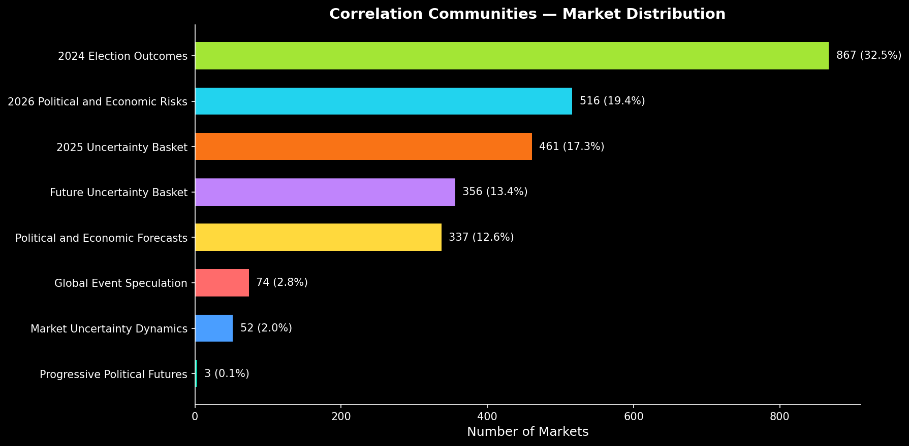
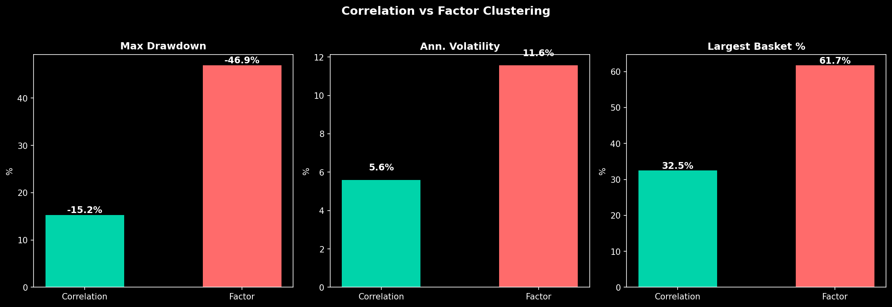
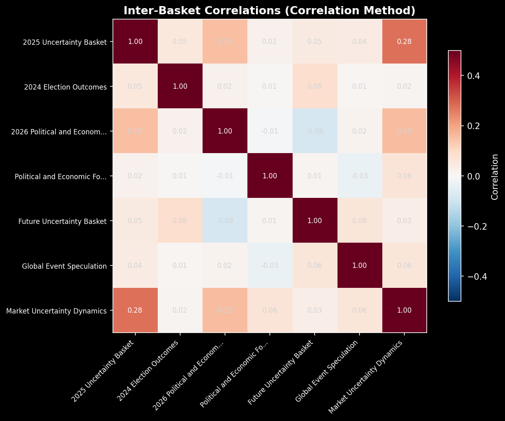

# basket-engine

Prediction market basket construction using **weighted hybrid clustering**. Combines correlation-based community detection with LLM theme categories to build semantically meaningful and data-driven market communities.

## What This Does

Takes raw prediction market data and answers: **can you build diversified, investable baskets of prediction markets?**

### Pipeline

1. **Ingest** 20,180 markets from Polymarket (+ 175 Kalshi)
2. **LLM classify** into 19 theme categories (crypto, US elections, etc.)
3. **Compute pairwise correlations** on daily price changes (1,933 × 1,933 matrix)
4. **Build weighted hybrid graph**:
   - Intra-theme edges: correlation ≥ 0.3 → weight = correlation × 4.0
   - Cross-theme edges: correlation ≥ 0.5 → weight = correlation
5. **Louvain community detection** on weighted graph finds market clusters
6. **LLM labels** each community with an investable name
7. **41-factor model** characterizes each basket's macro exposure
8. **Risk-parity weighting** within each community
9. **Backtest** against traditional assets and factor-based approach

## Key Findings

### Weighted hybrid clustering achieves optimal balance

Combines data-driven correlations with semantic theme structure to avoid both pure noise and rigid silos:

| Metric | Hybrid Method | Pure Correlation | Factor Method |
|--------|---------------|------------------|---------------|
| Modularity | **0.668** | 0.411 | 0.235 |
| Theme purity | **81.2%** | ~40% | N/A |
| Theme cohesion | **83.6%** | ~60% | N/A |
| Communities | **61** | 7 | 5 |
| Max community | **229 markets** | 867 | 1,600+ |

### Discovered hybrid communities

Natural clusters that respect both correlation patterns AND semantic meaning:

| Community | Markets | Dominant Theme | Purity | LLM Label |
|-----------|---------|---------------|--------|-----------|
| 3 | 229 | crypto_digital | 87.8% | Cryptocurrency and Alien Predictions |
| 9 | 220 | us_elections | 61.8% | 2028 Presidential Nomination Predictions |
| 6 | 180 | global_politics | 82.2% | Global Political Predictions Basket |
| 13 | 170 | global_politics | 68.2% | Global Political Predictions Basket |
| 10 | 161 | us_elections | 90.7% | 2024 US Election Predictions |
| 7 | 85 | fed_monetary_policy | 88.2% | Fed Chair and Rate Predictions |

**Hybrid advantage**: Communities are both statistically coherent (high modularity 0.668) and semantically meaningful (81% theme purity). Cross-theme connections allowed only for overwhelming correlations (≥0.5), preventing artificial theme silos while maintaining interpretability.

Modularity score: **0.668** (excellent community structure). Edge composition: 63% intra-theme, 37% cross-theme.



### 41-factor model confirms diversification

Expanded from 9 to 41 external factors (full US yield curve, global equities, global bonds, commodities). Uses Ridge regression to handle multicollinearity.

| Metric | 9 Factors | 41 Factors |
|--------|-----------|------------|
| Mean R² | 0.108 | 0.395 |
| High R² markets (>0.10) | 37% | 93% |

Even with 41 global factors, 60%+ of prediction market variance remains idiosyncratic. International markets explain more than US-only, but prediction markets are still fundamentally event-driven.




### Portfolio value

Adding 10% prediction markets to 60/40 reduces volatility by ~10% and max drawdown by ~10%, at the cost of ~1.7pp return drag. Near-zero correlation with all traditional assets (SPY: -0.097, GLD: -0.020, BTC: +0.009).

## Taxonomy

```
Theme ("Central Banks & Monetary Policy")
  └─ Event ("Fed Rate Decision")
       └─ Ticker ("Will Fed cut 50bps?")  ← recurring concept, no expiration
            └─ CUSIP ("Will Fed cut 50bps in March 2025?")  ← specific contract, resolves on date
```

A Ticker spawns new CUSIPs over time. When one CUSIP resolves, the next one for that Ticker is already trading. Baskets maintain Event/Ticker exposure by rolling CUSIPs.

## Semantic Exposure Layer

Categorical events (multiple outcomes per event) have directional economic implications:

**"Who will Trump nominate as Fed Chair?"**
- Kevin Warsh → hawkish → rates ↑, dollar ↑, equity ↓
- Kevin Hassett → dovish → rates ↓, dollar ↓, equity ↑

GPT-4o-mini maps outcomes to 8-dimensional factor vectors. Net event exposure = probability-weighted sum across outcomes. 31 events mapped.

## Factor Universe (41 factors)

| Category | Tickers | Count |
|----------|---------|-------|
| US Rates | IRX, SHY, FVX, TNX, TLH, TLT, TYX | 7 |
| Global Bonds | IGLT.L, IBGL.L, BNDX, EMB, BWX, IGOV | 6 |
| US Equity | SPY, QQQ | 2 |
| Global Equity Indices | FTSE, DAX, N225, Shanghai, CAC40, STOXX50E, HSI, SENSEX, BVSP, KOSPI | 10 |
| Country ETFs | EWC, EWA, EWW, EWT, EIDO, TUR, EZA, KSA, EWL, EWS | 10 |
| Commodities | GLD, USO, NG=F | 3 |
| Other | VIX, DXY, BTC | 3 |

Ridge regression (α=1.0) handles multicollinearity across correlated factors.

## Architecture

```
src/
├── ingestion/              # Polymarket + Kalshi API clients
├── classification/         # Four-layer taxonomy, LLM classifier
├── exposure/               # Side detection (long/short), normalization
├── analysis/
│   ├── correlation_clustering.py  # Pairwise correlations → Louvain communities
│   ├── factor_model.py            # 41-factor Ridge regression
│   ├── factor_clustering.py       # Legacy k-means (for comparison)
│   ├── semantic_exposure.py       # Categorical outcome → economic factors
│   ├── cross_asset.py             # Benchmark correlation analysis
│   └── regime.py                  # Risk-on/off regime detection
├── construction/
│   ├── correlation_baskets.py     # Community-based basket construction
│   ├── factor_baskets.py          # Legacy factor-based baskets
│   └── weighting.py               # Risk-parity, equal, market-cap
├── backtest/               # Backtest runner, return calculation
├── benchmarks/             # yfinance data fetching
└── validation/             # Sanity checks, stability tests
```

## Setup

```bash
python3 -m venv .venv
source .venv/bin/activate
pip install -r requirements.txt
cp .env.example .env  # Add OPENAI_API_KEY for LLM classification
```

## Usage

```bash
# Full correlation-based pipeline
python3 run_correlation_pipeline.py

# Legacy factor-based pipeline
python3 scripts/full_pipeline.py

# Individual steps
python3 -m src.analysis.correlation_clustering
python3 -m src.analysis.market_factors
python3 -m src.backtest.factor_backtest
```

## Outputs

```
data/
├── processed/
│   ├── markets.parquet                # 20,180 market metadata
│   ├── prices.parquet                 # 383K daily price observations
│   ├── benchmarks.parquet             # 41 factors, 734 days
│   ├── correlation_matrix.parquet     # 2,666 x 2,666 pairwise correlations
│   ├── community_assignments.parquet  # Market → community mapping
│   ├── community_labels.json          # LLM-generated basket names
│   ├── factor_loadings.parquet        # Per-market factor betas (41 factors)
│   ├── semantic_exposures.json        # Categorical event factor vectors
│   └── final_classifications.csv      # LLM theme labels (6,769 events)
└── outputs/
    ├── charts/                        # Visualization PNGs
    ├── basket_returns.csv             # Daily returns (correlation baskets)
    ├── basket_correlations.csv        # Inter-basket correlations
    ├── basket_weights.csv             # Risk-parity weights
    └── basket_compositions.json       # Market IDs per basket
```

## Tests

```bash
pytest              # 239+ tests
pytest tests/ -v    # Verbose
```





## Known Limitations

1. **No contract rolling.** Current backtest treats CUSIPs as static holdings. When they resolve, they disappear instead of rolling into the next CUSIP for the same Ticker. This creates artificial negative drag and shrinking baskets. Major next step.
2. **Single platform.** Primarily Polymarket. Kalshi coverage is thin (175 markets).
3. **44% of active markets have no price history** (low-volume, AMM-only).
4. **Static correlations.** Should use rolling windows for regime adaptation.
5. **No entry/exit signals.** Backtest assumes continuous holding.

## Research

See **[RESEARCH.md](RESEARCH.md)** for full methodology and analysis.
