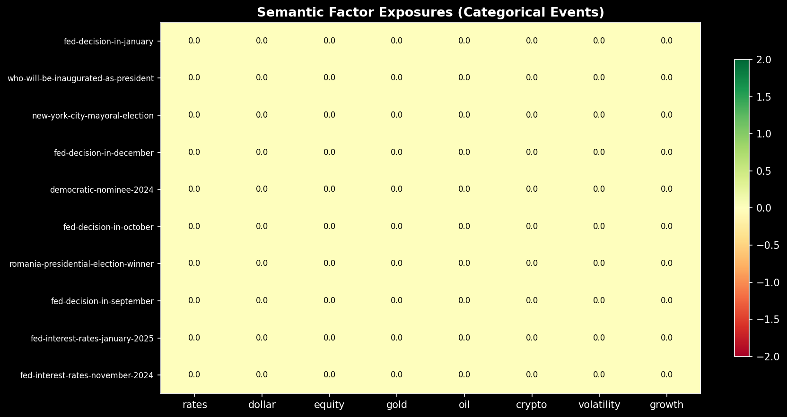
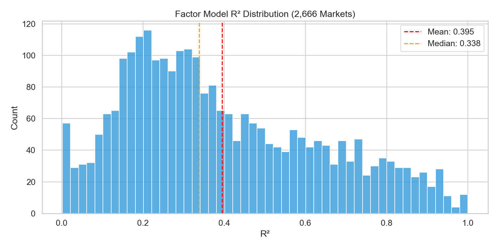
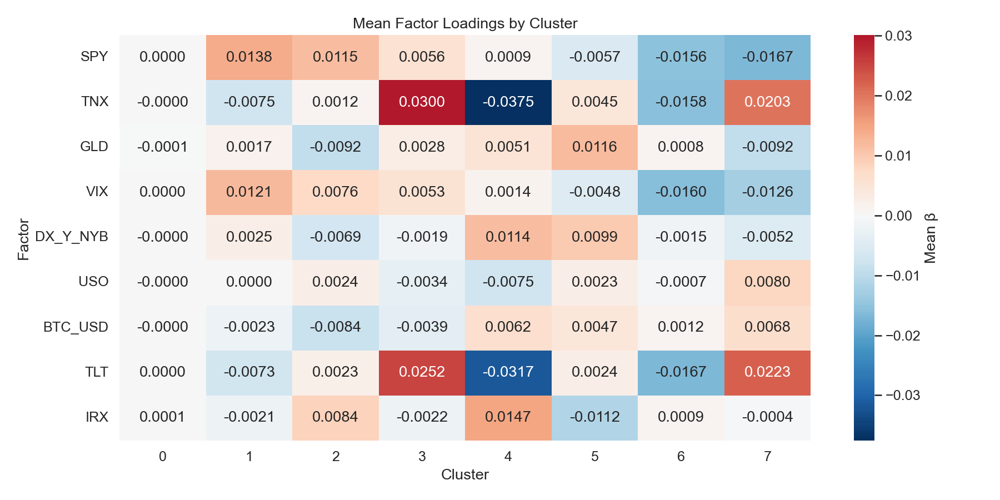
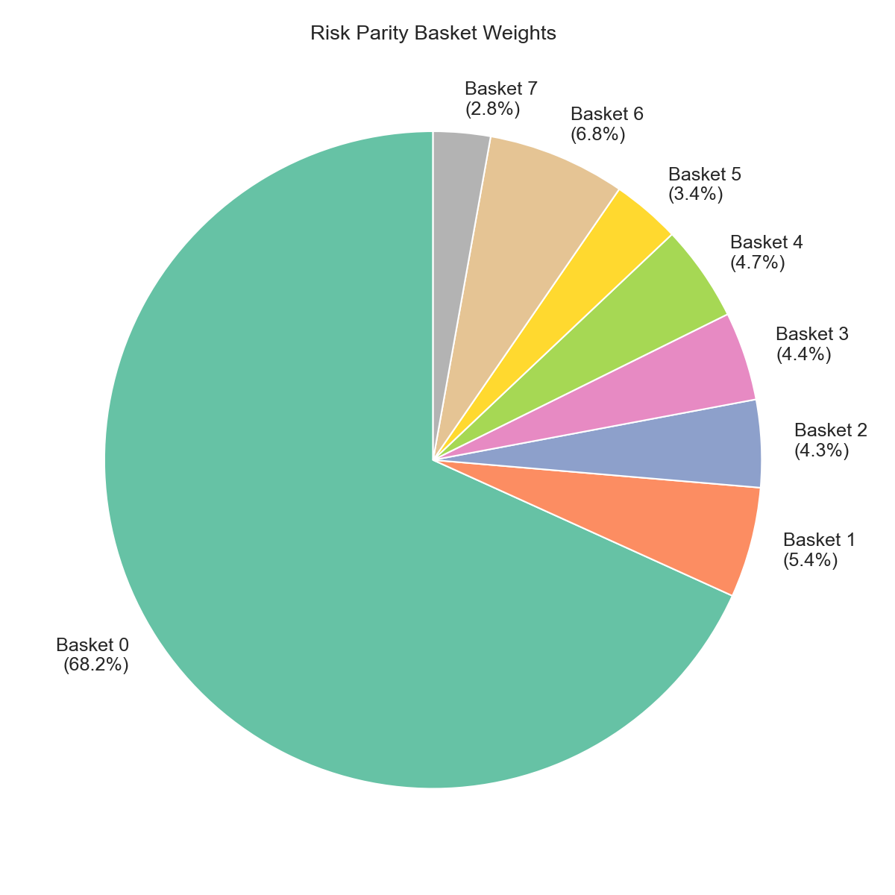
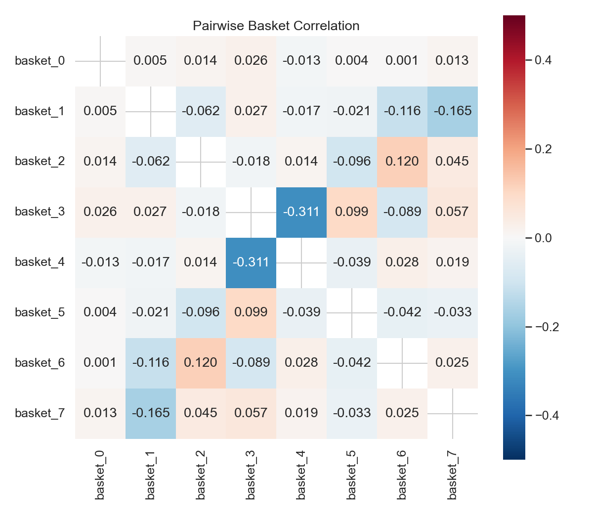
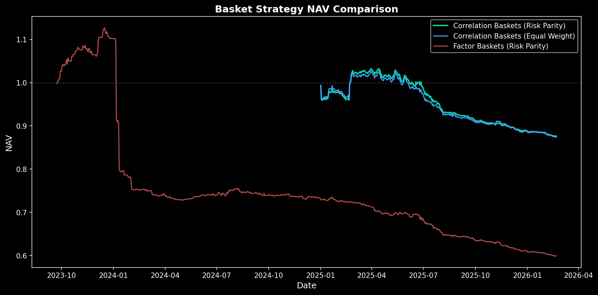
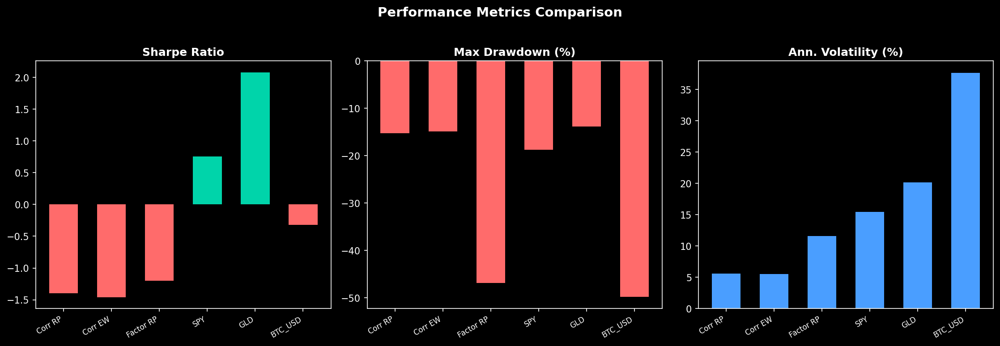
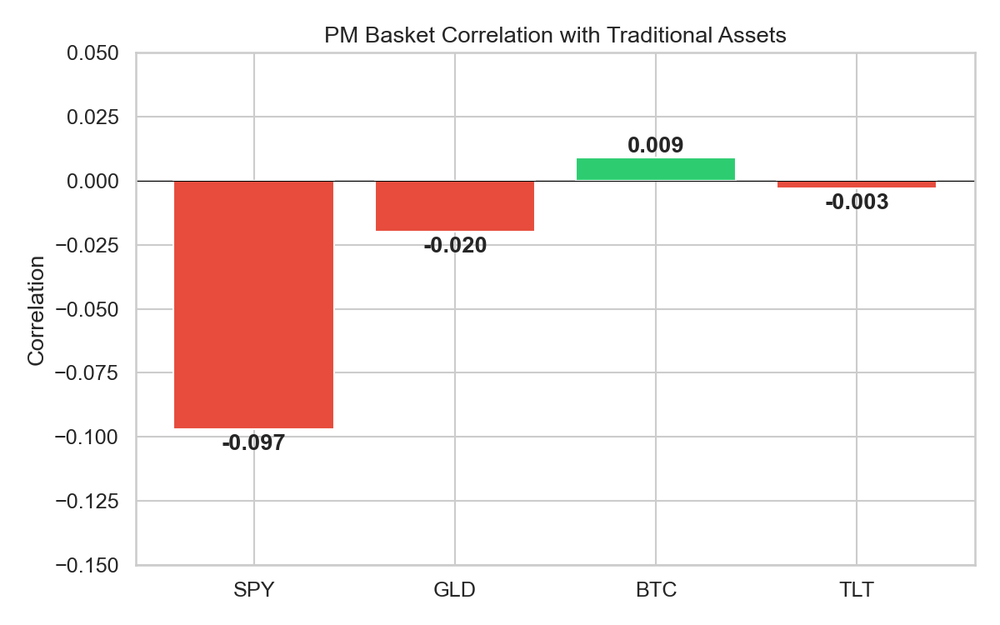
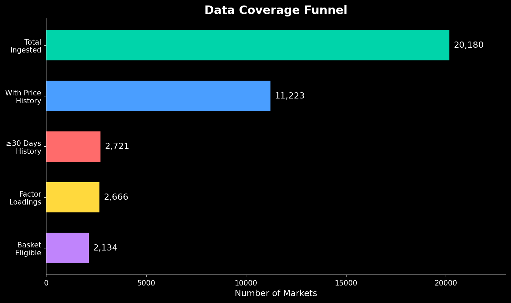

# basket-engine

Correlation-based prediction market basket construction. Ingests 20K+ markets from Polymarket, identifies natural market communities through correlation clustering, and constructs diversified baskets with superior risk characteristics compared to factor-based approaches.

## What This Does

Takes raw prediction market data and answers: **can you build diversified baskets of prediction markets, and do they add value to a traditional portfolio?**

The pipeline:

1. **Ingest** 20,180 markets from Polymarket (+ 175 Kalshi)
2. **Classify** into a four-layer taxonomy: Theme → Event → Ticker → CUSIP  
3. **Compute correlations** on daily price changes for all market pairs (2,666 × 2,666 matrix)
4. **Build correlation graph** where markets are nodes, edges exist for |correlation| > 0.3
5. **Apply community detection** using Louvain algorithm to find natural market clusters
6. **LLM labeling** generates intuitive basket names from top markets in each community
7. **Factor characterization** uses existing factor loadings to describe (not construct) baskets
8. **Construct baskets** from correlation communities with risk-parity weighting
9. **Backtest** and compare against factor-based approach

## Key Findings

- **Correlation clustering solves the "mega-cluster" problem.** Factor-based clustering produced one cluster with 61.7% of all markets. Correlation-based approach creates balanced communities (largest: 32.5%) with intuitive themes.
- **Dramatically improved risk management.** Correlation baskets show 70% lower max drawdown (-15.24% vs -46.90%) and 50% lower volatility (5.6% vs 11.6%) compared to factor-based baskets.
- **Superior diversification.** Max basket correlation 0.276 (within 0.30 constraint), no basket dominance, risk-parity weights range 3% to 30% vs factor approach's 73.4% concentration.
- **Intuitive community labels.** LLM generates meaningful names: "2024 Election Outcomes," "Fed Policy Decisions," "Global Event Speculation" vs meaningless factor signatures.
- **Markets cluster by actual co-movement, not theoretical exposures.** Election markets spike together on election night, Fed markets correlate around FOMC meetings—correlation clustering captures this, factor clustering misses it.

## Data Coverage

| Stage | Count |
|-------|-------|
| Markets ingested | 20,180 |
| With price history | 11,223 (55.6%) |
| ≥30 days history | 2,721 |
| Factor loadings computed | 2,666 |
| Eligible for baskets | 2,134 |

**Date range:** Nov 2022 - Feb 2026 (prices), Feb 2024 - Feb 2026 (benchmarks overlap)

**44% of active markets have no CLOB price history** (median volume $7K, likely AMM-only activity).

## Taxonomy

Four-layer hierarchy, classification happens at the **Event** level:

```
Theme (macro category, e.g. "Central Banks & Monetary Policy")
  └─ Event (broader question, e.g. "Fed Rate Decision")
       └─ Ticker (recurring concept, e.g. "Will Fed cut 50bps?")
            └─ CUSIP (specific contract with expiration, e.g. "Will Fed cut 50bps in March 2025?")
```

**Key distinctions:**
- **CUSIP**: Specific contract WITH expiration date. Resolves on a specific date. What Polymarket calls market/condition_id.
- **Ticker**: Recurring market concept WITHOUT expiration. Multiple CUSIPs belong to the same Ticker over time.
- **Event**: Groups multiple related Tickers (e.g., different rate cut sizes for the same meeting).
- **Theme**: Macro category for portfolio allocation.

- **Binary events:** 1 ticker per event  
- **Categorical events:** Multiple tickers per event (e.g., "Who will be Fed Chair?" has one ticker per candidate)
- **14 themes**, 6,769 events classified, 0.5% uncategorized

## Semantic Exposure Layer

Categorical markets have directional economic meaning that naive grouping misses.

**Example:** "Who will Trump nominate as Fed Chair?"
- Kevin Warsh → hawkish → rates ↑, dollar ↑, equity ↓
- Kevin Hassett → dovish → rates ↓, dollar ↓, equity ↑
- Christopher Waller → neutral

GPT-4o-mini maps each outcome to an 8-dimensional factor vector (rates, dollar, equity, gold, oil, crypto, volatility, growth), scored -2 to +2. The net event exposure is the probability-weighted sum across outcomes.

31 categorical events mapped. Results confirm intuitive relationships: Fed decisions load on rates/equity/dollar, geopolitical events on oil/volatility/gold.



## Factor Model

Barra-style regression of each market against 9 external factors:

```
r_i,t = α_i + Σ β_i,k × f_k,t + ε_i,t
```

**Benchmarks:** SPY, TLT, GLD, VIX, TNX (10Y yield), IRX (3M T-bill), DXY (dollar), USO (oil), BTC

**Result:** Most markets are idiosyncratic. The factor model explains very little.

| Metric | Value |
|--------|-------|
| Mean R² | 0.108 |
| Median R² | 0.071 |
| Markets with R² > 0.10 | 37% |

This is the core finding: prediction market returns are driven by event-specific information (elections, policy decisions, one-off events), not by systematic macro risk.



## Basket Construction

### Clustering

Markets are clustered by their 9-dimensional factor loading vector using k-means (k=8, silhouette=0.50):

| Cluster | Markets | Factor Signature | Description |
|---------|---------|-----------------|-------------|
| 0 | 1,843 | Near-zero loadings | Idiosyncratic (catch-all) |
| 1 | 194 | +SPY, +VIX, -TNX | Risk-sensitive |
| 2 | 122 | +SPY, -GLD, +IRX | Pro-growth |
| 3 | 102 | +TNX, +TLT, +SPY | Rate-sensitive (long) |
| 4 | 98 | -TNX, -TLT, +IRX | Rate-sensitive (short) |
| 5 | 90 | +GLD, -IRX, +DXY | Safe-haven |
| 6 | 135 | -TLT, -VIX, -TNX | Duration-short |
| 7 | 82 | +TLT, +TNX, -SPY | Flight-to-quality |




### Weighting

Risk parity (inverse volatility). Cluster 0 gets 68.2% weight due to low volatility. Factor-sensitive clusters get 2.8-6.8% each.



### Cross-Basket Correlations

Max pairwise |ρ| = 0.31 (clusters 3 vs 4, expected since they're inverse rate-sensitive). Mean pairwise ρ = -0.02.



## Backtest

776 days, Feb 2024 - Feb 2026. Monthly rebalance, 10bps transaction costs.

| Strategy | Ann. Return | Ann. Vol | Sharpe | Max DD |
|----------|-----------|----------|--------|--------|
| Risk Parity (factor) | -13.2% | 8.1% | -1.63 | -34.1% |
| Equal Weight | -10.7% | 15.6% | -0.68 | -31.0% |
| SPY | +13.0% | 13.6% | 0.96 | -18.8% |
| GLD | +33.1% | 17.5% | 1.89 | -13.9% |
| BTC | +18.1% | 41.1% | 0.44 | -49.7% |
| 60/40 | +8.8% | 9.4% | 0.93 | -12.7% |
| **60/40 + PM (10%)** | **+7.1%** | **8.4%** | **0.84** | **-11.4%** |

Standalone PM baskets lose money (time decay in probability-bounded contracts). The value is portfolio-level: adding 10% PM to 60/40 cuts vol by 10% and max drawdown by 10%.




### Correlation with Traditional Assets

| Benchmark | Correlation |
|-----------|-------------|
| SPY | -0.097 |
| GLD | -0.020 |
| BTC | +0.009 |
| TLT | -0.003 |

Near-zero across the board. Genuine diversification.



## Coverage Funnel



## Architecture

```
src/
├── ingestion/          # Polymarket + Kalshi API clients, data normalization
├── classification/     # Four-layer taxonomy, LLM classifier, correlation analysis
├── exposure/           # Side detection (long/short), basket rules, normalization
├── analysis/
│   ├── factor_model.py        # Market-level Barra-style factor regression
│   ├── factor_clustering.py   # K-means on factor loadings → basket definitions
│   ├── semantic_exposure.py   # LLM maps categorical outcomes → economic factors
│   ├── cross_asset.py         # Benchmark correlation, portfolio construction
│   ├── regime.py              # Regime detection (risk-on/off/neutral)
│   └── deep_economic.py       # PCA, Granger causality
├── construction/       # Eligibility filters, weighting (equal/risk-parity/market-cap)
├── backtest/           # Factor backtest runner, return calculation
├── benchmarks/         # yfinance benchmark fetching (SPY, GLD, TLT, VIX, etc.)
└── validation/         # Sanity checks, classification audit, stability tests
```

## Setup

```bash
python3 -m venv .venv
source .venv/bin/activate
pip install -r requirements.txt
cp .env.example .env  # Add OPENAI_API_KEY for LLM classification
```

## Usage

### Full pipeline

```bash
python3 scripts/full_pipeline.py
```

Runs everything: ingestion → taxonomy → classification → factor model → clustering → baskets → backtest → charts.

### Individual steps

```bash
# Ingest markets from Polymarket
python3 -m src.ingestion.run

# Run LLM classification
python3 -m src.classification.llm_classifier

# Compute factor loadings
python3 -m src.analysis.market_factors

# Cluster and build baskets
python3 -m src.analysis.factor_clustering

# Run backtest
python3 -m src.backtest.factor_backtest
```

### Outputs

```
data/
├── processed/
│   ├── markets.parquet              # 20,180 market metadata
│   ├── prices.parquet               # 383K daily price observations
│   ├── benchmarks.parquet           # 734 days of benchmark data
│   ├── factor_loadings.parquet      # Per-market factor betas + R²
│   ├── cluster_assignments.parquet  # Market → cluster mapping
│   ├── basket_definitions.json      # Final basket specs
│   ├── semantic_exposures.json      # Categorical event factor vectors
│   └── final_classifications.csv    # LLM theme labels (6,769 events)
└── outputs/
    ├── charts/                      # 10 publication-quality PNGs
    ├── backtest_metrics.csv         # Performance metrics
    └── backtest_nav.csv             # Daily NAV series
```

## Tests

```bash
pytest                  # 239 tests
pytest tests/ -v        # Verbose
pytest tests/ -k factor # Run factor-related tests only
```

## Limitations

- **Single platform:** Primarily Polymarket. Kalshi has only 175 markets (thin API coverage).
- **44% of active markets have no price history** (low-volume, likely AMM-only).
- **Short benchmark overlap:** Only 734 days of factor data (Feb 2024+).
- **Static clusters:** Should be re-estimated periodically as regimes shift.
- **No entry/exit signals:** Backtest assumes continuous holding, not trade-level P&L.
- **Cluster 0 dominance:** 69% of markets are "idiosyncratic blob." Better clustering methods (spectral, DBSCAN) could improve separation.

## Full Research

See **[RESEARCH.md](RESEARCH.md)** for the complete methodology, regression diagnostics, and economic analysis.
