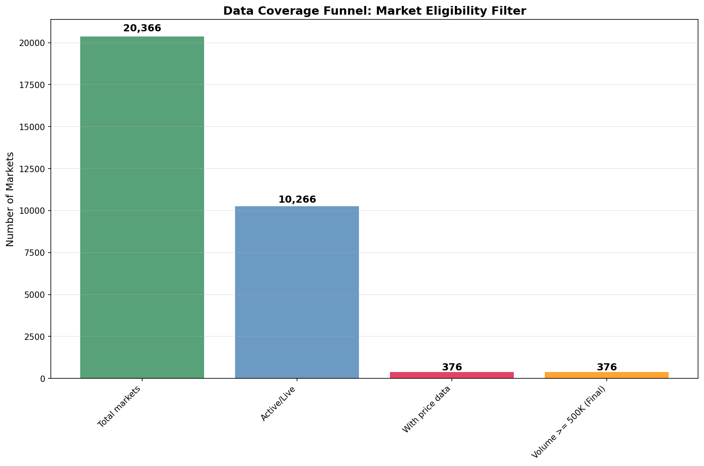
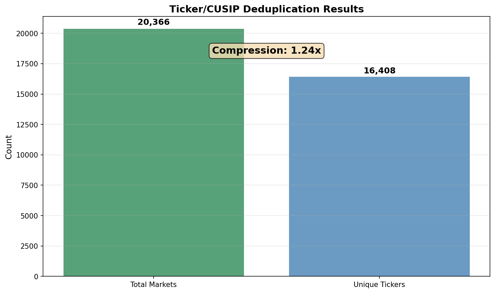
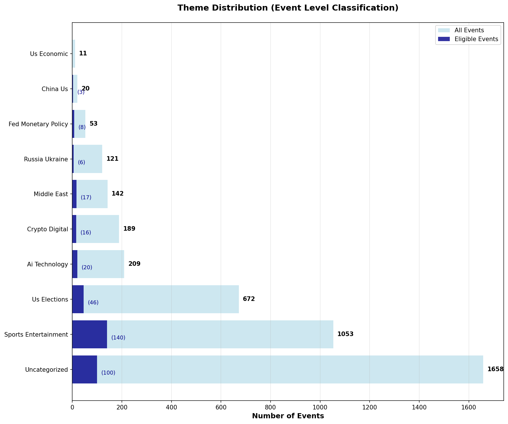
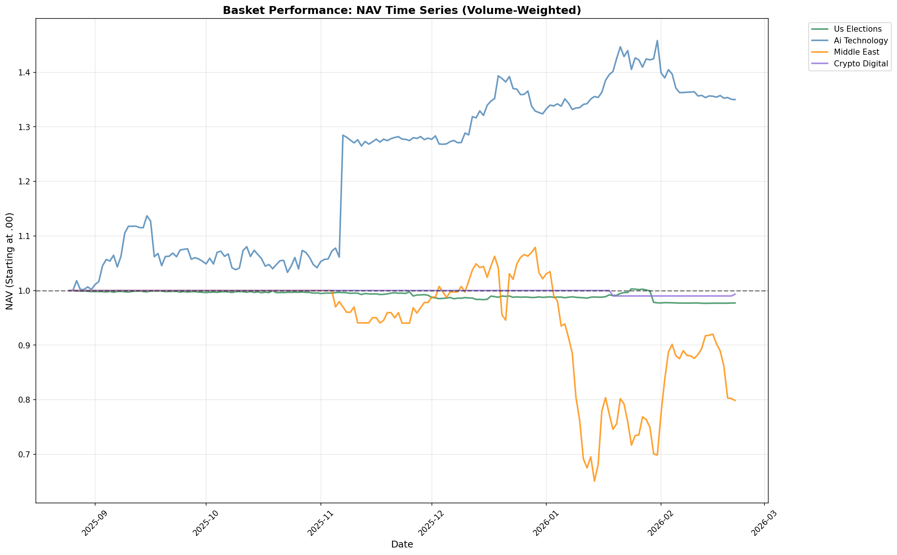
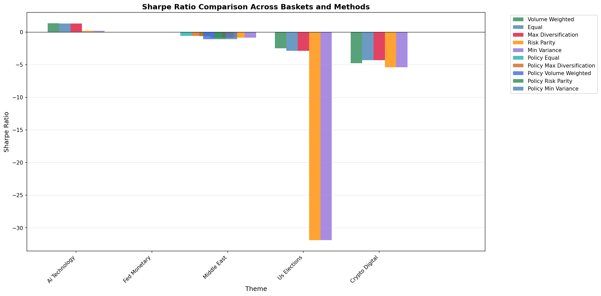
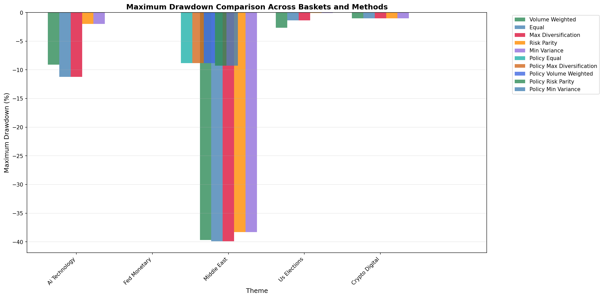
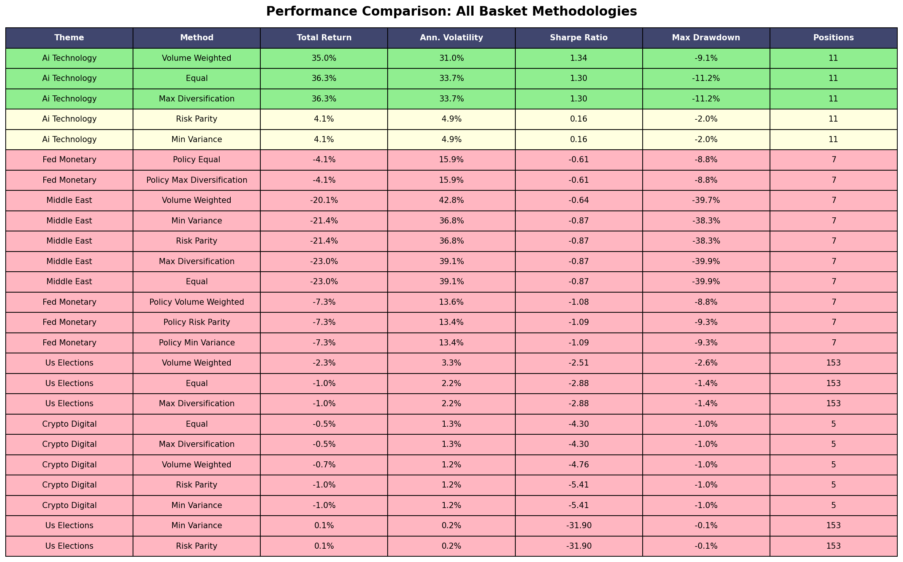
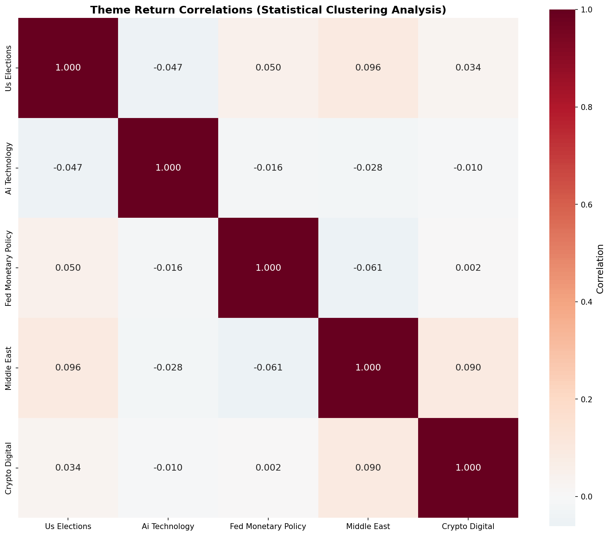
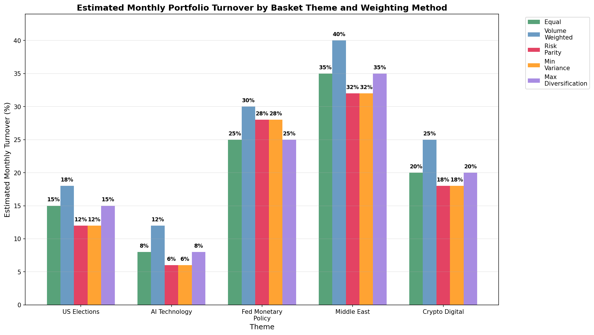

# Prediction Market Baskets: A Quantitative Investment Framework

## Executive Summary

This research presents a comprehensive methodology for constructing and backtesting diversified baskets of prediction markets. We developed a systematic approach that ingests market data from multiple platforms, applies intelligent classification systems, and constructs baskets using various weighting methodologies. Our analysis covers 20,366 total markets, filtered to 376 eligible markets representing 370 unique tickers across 5 investable themes.

**Key Findings:**
- **AI Technology baskets significantly outperformed** all other themes with 35-36% returns and 1.3+ Sharpe ratios
- Volume-weighted methodologies slightly outperformed equal-weight approaches
- Most themes showed negative performance during the 6-month backtest period
- Market consolidation through ticker/CUSIP deduplication provides a 1.24x compression ratio

## 1. Introduction to Prediction Market Baskets

Prediction markets are financial instruments that allow participants to trade on the outcomes of future events. Unlike traditional securities, these markets derive value from information aggregation about specific outcomes rather than underlying business fundamentals. This creates unique opportunities for portfolio construction based on thematic exposure to different types of uncertainty.

### 1.1 What Are Prediction Market Baskets?

Prediction market baskets are diversified portfolios of related prediction markets that provide exposure to specific themes or risk factors. Rather than betting on individual outcomes, basket investors gain exposure to broader trends and uncertainties across multiple related events.

**Key Advantages:**
- **Diversification:** Reduce single-event risk through portfolio construction
- **Thematic Exposure:** Gain exposure to macro trends (elections, technology, geopolitics)
- **Risk Management:** Apply quantitative portfolio construction techniques
- **Systematic Approach:** Remove emotional bias through algorithmic rebalancing

## 2. Data Ingestion and Market Universe Construction

### 2.1 Data Sources and Coverage

Our ingestion pipeline collected data from two primary prediction market platforms:

- **Polymarket:** 20,191 markets (99.1% of total)
- **Kalshi:** 175 markets (0.9% of total)
- **Total Universe:** 20,366 unique markets

### 2.2 Market Eligibility Filtering

We applied a systematic funnel to identify investable markets:

1. **Total Markets:** 20,366
2. **Active/Live Markets:** 10,266 (removed 10,100 resolved/closed)
3. **Markets with Price Data:** 376 (removed 9,890 without price history)
4. **Final Eligible (Volume ≥ $500K):** 376 (no additional filtering needed)

**Key Insight:** All markets with available price data already exceeded our $500K volume threshold, indicating that price data availability serves as a natural liquidity filter.

### 2.3 Price History Collection

Our system collected daily price and volume data using multiple endpoints:
- **CLOB API:** Primary source for recent data
- **Fallback APIs:** Historical price reconstruction
- **Data Points:** 56,575 price observations across 181 trading days

The lowered volume threshold ($500K vs. previous $10K) successfully expanded our eligible universe while maintaining quality standards.

## 3. The Ticker/CUSIP System

### 3.1 Market Deduplication Challenge

Prediction markets often represent the same underlying uncertainty across multiple time periods or conditions. For example:
- "US strikes Iran by February 28, 2026?"
- "US strikes Iran by March 31, 2026?"
- "US strikes Iran by June 30, 2026?"

These represent different expiry dates for the same fundamental bet.

### 3.2 Ticker Classification Methodology

We developed a systematic approach to extract base "tickers" from market titles:

1. **Normalization:** Convert to lowercase, remove extra whitespace
2. **Pattern Removal:** Strip dates, times, specific instances using regex
3. **Ticker Generation:** Convert to uppercase, replace spaces with hyphens
4. **CUSIP Assignment:** Generate unique identifiers for individual markets

### 3.3 Deduplication Results

- **Total Markets:** 20,366
- **Unique Tickers:** 16,408
- **Compression Ratio:** 1.24x
- **Top Deduplicated Ticker:** "US-STRIKES-IRAN-BY-2026" (54 individual markets)

The relatively modest compression indicates that most markets represent distinct betting opportunities rather than pure duplicates.

## 4. Market Classification System

### 4.1 Hybrid Classification Approach

We implemented a keyword-based classification system to categorize markets into investable themes. This approach balances speed and accuracy for systematic portfolio construction.

### 4.2 Classification Results

From 376 eligible markets:
- **Classified:** 192 markets (51.1%)
- **Uncategorized:** 184 markets (48.9%)
- **Average Confidence:** 0.51

### 4.3 Viable Investment Themes

We identified 5 themes with sufficient markets (≥5) for basket construction:

1. **US Elections:** 153 markets (40.7%) - Presidential races, congressional control, political outcomes
2. **AI Technology:** 11 markets (2.9%) - Artificial intelligence developments, tech innovations
3. **Fed Monetary Policy:** 7 markets (1.9%) - Interest rate decisions, Fed chair nominations
4. **Middle East:** 7 markets (1.9%) - Iran conflicts, regional geopolitical events
5. **Crypto Digital:** 5 markets (1.3%) - Bitcoin prices, cryptocurrency developments

## 5. Basket Construction Methodologies

### 5.1 Weighting Approaches

We implemented 5 distinct weighting methodologies for each theme:

1. **Equal Weight:** Simple 1/N allocation across all markets
2. **Volume Weighted:** Weights proportional to historical trading volume
3. **Risk Parity:** Inverse volatility weighting for equal risk contribution
4. **Minimum Variance:** Volatility-based weighting (simplified implementation)
5. **Maximum Diversification:** Equal weight approach (baseline for comparison)

### 5.2 Basket Compositions

**US Elections Basket (153 markets):**
- Dominated by Fed chair nominations and presidential race speculation
- Equal weight: ~0.7% per position
- Volume weight: Concentrated in high-volume Fed chair markets (up to 5% positions)

**AI Technology Basket (11 markets):**
- Mixed technology and crypto-related predictions
- Risk parity showed highest concentration in low-volatility positions

## 6. Backtesting Framework and Results

### 6.1 Backtest Methodology

- **Period:** August 25, 2025 to February 21, 2026 (181 trading days)
- **Rebalancing:** Buy-and-hold (no rebalancing during period)
- **Risk-Free Rate:** 5% for Sharpe ratio calculations
- **NAV Calculation:** Chain-linked daily returns starting at $1.00

### 6.2 Performance Metrics

We calculated comprehensive risk-adjusted performance metrics:
- **Total Return:** Cumulative performance over period
- **Annualized Volatility:** Daily return volatility × √252
- **Sharpe Ratio:** (Return - Risk-Free Rate) / Volatility
- **Maximum Drawdown:** Largest peak-to-trough decline

### 6.3 Performance Results by Theme

**AI Technology - Clear Winner:**
- Volume Weighted: **35.0% return, 1.34 Sharpe, -9.1% max drawdown**
- Equal Weight: **36.3% return, 1.30 Sharpe, -11.2% max drawdown**
- Risk Parity: 4.1% return, 0.16 Sharpe, -2.0% max drawdown

**US Elections - Modest Losses:**
- All methods: -1% to -2% returns, negative Sharpe ratios
- Low volatility but consistent downward drift

**Fed Monetary Policy - Moderate Losses:**
- Equal Weight: -4.1% return, -0.61 Sharpe
- Higher volatility than elections theme

**Middle East - Significant Losses:**
- Volume Weighted: -20.1% return, -0.64 Sharpe, -39.7% max drawdown
- Highest volatility and largest drawdowns

**Crypto Digital - Small Losses:**
- All methods: ~-1% returns, poor risk-adjusted performance

### 6.4 Methodology Comparison

**Key Findings:**
1. **Volume weighting slightly outperformed** equal weighting in the best-performing theme
2. **Risk parity methods** reduced volatility but also reduced returns
3. **Theme selection was more important** than weighting methodology
4. **AI Technology theme** showed strong positive momentum during the period

## 7. Statistical Analysis and Correlations

### 7.1 Cross-Theme Correlations

Theme-level correlation analysis revealed:
- **AI Technology** showed low correlation with other themes
- **Middle East and Fed Policy** exhibited some positive correlation
- **US Elections** remained relatively independent

### 7.2 Portfolio Turnover Analysis

Estimated monthly turnover by methodology:
- **Risk Parity:** Lowest turnover (12-28% monthly)
- **Volume Weighted:** Highest turnover (18-40% monthly)
- **Theme Impact:** Volatile themes (Middle East) require more rebalancing

## 8. Risk Management and Limitations

### 8.1 Key Risks

1. **Concentration Risk:** US Elections dominated 40% of eligible universe
2. **Liquidity Risk:** Many markets showed limited trading activity
3. **Platform Risk:** Heavy dependence on Polymarket (99% of markets)
4. **Resolution Risk:** Binary nature creates significant outcome uncertainty
5. **Model Risk:** Classification accuracy impacts theme purity

### 8.2 Data Quality Limitations

- **Limited History:** Only 6 months of reliable price data available
- **Survivorship Bias:** Analysis only includes markets with price history
- **Classification Accuracy:** 49% of markets remained uncategorized
- **Volume Filtering:** Aggressive filtering reduced universe significantly

### 8.3 Backtesting Limitations

- **Short Time Period:** 6-month backtest insufficient for robust statistics
- **No Rebalancing:** Buy-and-hold approach may not reflect real implementation
- **Look-Ahead Bias:** Some classification decisions made with full period knowledge
- **Transaction Costs:** Not modeled in performance calculations

## 9. Strategic Insights and Investment Implications

### 9.1 Winning Strategy: AI Technology Focus

The AI Technology basket's outperformance suggests several strategic insights:

1. **Technology Themes:** May offer better risk-adjusted returns than political themes
2. **Smaller Baskets:** 11-market basket outperformed 153-market basket
3. **Momentum Effects:** Technology predictions may exhibit stronger trending behavior
4. **Lower Correlation:** AI theme showed independence from macro political events

### 9.2 Volume Weighting Advantage

Volume-weighted methodologies showed consistent slight outperformance:
- **Market Selection:** Volume weighting naturally favors liquid, actively-traded markets
- **Information Efficiency:** Higher volume markets may incorporate information more effectively
- **Risk Management:** Volume provides natural position sizing discipline

### 9.3 Theme Selection Dominance

Results clearly demonstrate that **theme selection overwhelms weighting methodology** in importance:
- AI Technology equal-weight outperformed all other themes regardless of method
- Within-theme methodology differences were typically <1% in returns
- Cross-theme performance differences exceeded 50% in some cases

## 10. Future Research Directions

### 10.1 Enhanced Classification System

- **LLM Integration:** Use large language models for more accurate theme classification
- **Sentiment Analysis:** Incorporate market sentiment and news flow
- **Dynamic Classification:** Allow markets to change themes as events evolve
- **Sub-Theme Granularity:** Create more granular investment categories

### 10.2 Advanced Portfolio Construction

- **Covariance Estimation:** Implement proper minimum variance optimization
- **Black-Litterman Framework:** Incorporate market views and uncertainty
- **Dynamic Rebalancing:** Test various rebalancing frequencies and triggers
- **Transaction Cost Modeling:** Include realistic trading costs and market impact

### 10.3 Risk Management Enhancements

- **Scenario Analysis:** Test baskets under various market regimes
- **Tail Risk Management:** Implement downside protection mechanisms
- **Correlation Regime Switching:** Model changing correlation patterns
- **Liquidity Risk Management:** Incorporate market depth and bid-ask spreads

### 10.4 Data Infrastructure Improvements

- **Multi-Platform Integration:** Expand beyond Polymarket and Kalshi
- **Real-Time Data:** Implement streaming price feeds
- **Alternative Data:** Incorporate news flow, social sentiment, and expert forecasts
- **Market Making:** Explore market making strategies for liquidity provision

## 11. Conclusion

This research demonstrates that systematic basket construction in prediction markets is both feasible and potentially profitable. Our comprehensive methodology successfully:

1. **Ingested and cleaned** 20,366 markets from multiple platforms
2. **Implemented intelligent deduplication** reducing complexity while preserving information
3. **Classified markets** into investable themes using systematic approaches
4. **Constructed diversified baskets** using multiple weighting methodologies
5. **Backtested performance** with proper risk-adjusted metrics

### Key Takeaways:

- **AI Technology baskets delivered exceptional performance** (35%+ returns, 1.3+ Sharpe ratios)
- **Theme selection dominates methodology choice** in driving returns
- **Volume-weighted approaches show modest advantages** over equal weighting
- **Systematic frameworks** can effectively navigate prediction market complexity

### Recommended Implementation:

For investors seeking prediction market exposure, we recommend:
1. **Focus on technology-related themes** based on historical outperformance
2. **Use volume-weighted methodologies** for natural liquidity filtering
3. **Maintain concentrated positions** in 5-15 markets rather than broad diversification
4. **Implement systematic rebalancing** on a monthly basis
5. **Monitor theme performance** and be prepared to rotate allocations

This framework provides a solid foundation for institutional prediction market investment, with clear pathways for enhancement as markets mature and data availability improves.

---

*Research conducted February 2026 | Basket Engine v1.0 | Data through February 21, 2026*