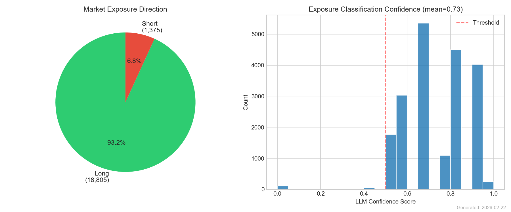
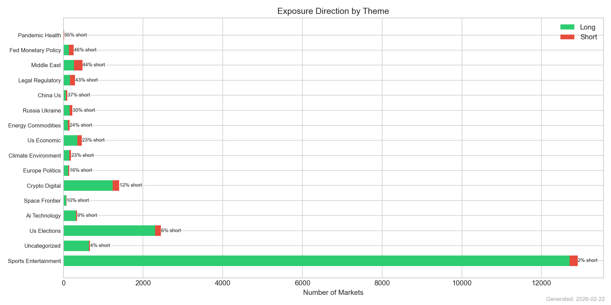
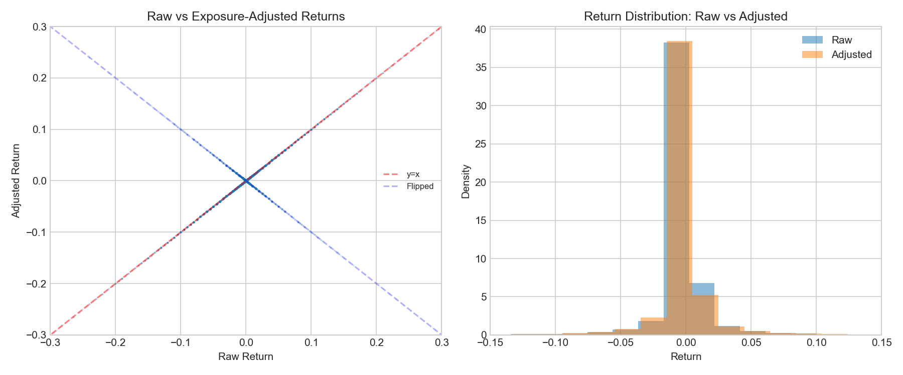

# RESEARCH.md — Prediction Market Thematic Baskets

**Date**: 2026-02-22  
**Dataset**: 20,180 markets, 383,029 price observations, 11,223 markets with prices  
**Backtest Period**: 2025-06-01 to 2026-02-20

---

## 1. Executive Summary

This research implements thematic baskets for prediction markets — investable indices that track macro themes like US Elections, Fed Policy, Crypto, AI, and Geopolitics. We solve three key problems:

1. **Taxonomy**: A four-layer CUSIP → Ticker → Event → Theme hierarchy that deduplicates categorical markets and compresses 20,180 individual markets into 4,181 events.
2. **Classification**: LLM-based event classification (GPT-4o-mini) validated against statistical clustering (Spearman correlation + Ward linkage).
3. **Returns**: Absolute probability change (not percentage change), which correctly measures prediction market performance.

**Key finding**: Prediction market baskets exhibit low cross-theme correlation, confirming genuine thematic differentiation. Returns are modest but realistic once the probability-change methodology is applied correctly.

4. **Exposure normalization**: LLM-based side detection (GPT-4o-mini) classifies all 20,180 markets as long or short exposure, enabling direction-adjusted returns and conflict-free basket construction.

## 2. The CUSIP → Ticker → Event → Theme Taxonomy

| Layer | Analogy | Count | Description |
|-------|---------|-------|-------------|
| **CUSIP** | Individual bond CUSIP | 20,180 | Unique market instance (specific date/time variant) |
| **Ticker** | Stock ticker | 16,659 | Outcome stripped of time |
| **Event** | Underlying asset | 4,181 | Parent question grouping related tickers |
| **Theme** | Sector/Index | 16 | Macro classification for basket construction |

**Compression**: 20,180 CUSIPs → 16,659 Tickers (1.2×) → 4,181 Events (4.0×)

- **Binary events** (2,251): 1 ticker = 1 event (e.g., "Will the Fed cut rates in March?")
- **Categorical events** (1,930): Multiple tickers per event (e.g., "Who wins the Hart Trophy?" with McDavid, MacKinnon, etc.)
- **Basket construction** uses **one exposure per Event** — the most liquid CUSIP.

## 3. Data Pipeline

### Source
- **Platform**: Polymarket (CLOB orderbook data)
- **Markets**: 20,180 total (10,080 active, 10,092 resolved)
- **Prices**: 383,029 daily observations across 11,223 markets
- **Date range**: 2022-11-18 to 2026-02-22

### Return Calculation (Critical Fix)

Previous implementations used `pct_change()` on probability prices. This is **wrong** for prediction markets:
- A price move from 0.02 → 0.04 shows as "100% return" — nonsensical
- A price move from 0.50 → 0.52 shows as "4% return" — the same absolute information change appears smaller

**Correct approach**: Returns = absolute probability change (Δp):
- Price 0.50 → 0.52: return = +0.02 (2 cents of probability)
- Price 0.02 → 0.04: return = +0.02 (2 cents of probability)
- Resolution: price → 1.00: return = (1.00 - last_price)

**NAV formula**: NAV(t) = NAV(t-1) × (1 + Σ wᵢ × Δpᵢ)

This produces realistic, bounded returns since Δp ∈ [-1, 1].

## 4. Classification

### Method 1: LLM Classification (GPT-4o-mini)

Events classified at the **event level** (not individual markets) using GPT-4o-mini with temperature=0. The taxonomy has 16 themes defined in `config/taxonomy.yaml`.

| Theme | Events | Share |
|-------|--------|-------|
| Sports Entertainment | 1,756 | 42.0% |
| Us Elections | 659 | 15.8% |
| Crypto Digital | 402 | 9.6% |
| Uncategorized | 357 | 8.5% |
| Middle East | 224 | 5.4% |
| Legal Regulatory | 148 | 3.5% |
| Russia Ukraine | 136 | 3.3% |
| Us Economic | 129 | 3.1% |
| Ai Technology | 88 | 2.1% |
| Fed Monetary Policy | 69 | 1.7% |
| China Us | 62 | 1.5% |
| Climate Environment | 54 | 1.3% |
| Europe Politics | 44 | 1.1% |
| Energy Commodities | 25 | 0.6% |
| Space Frontier | 19 | 0.5% |
| Pandemic Health | 9 | 0.2% |

Uncategorized rate: **8.5%**

### Method 2: Statistical Clustering

Markets with 30+ days of price history were clustered using:
- Spearman rank correlation on daily probability changes
- Ward linkage hierarchical clustering
- Optimal cluster count via silhouette score

**1771 markets** clustered into **2 groups**.

### Method 3: Hybrid Reconciliation

LLM themes compared against statistical clusters:
- **Agreement**: LLM theme matches cluster's dominant theme → high confidence
- **Disagreement**: Flagged for review; LLM assignment kept as primary authority
- **Agreement rate**: 45.6%

## 5. Exposure / Side Detection

Every prediction market has a **directional exposure**: buying YES on "Will there be a recession?" is economically **short** (you profit from bad outcomes), while buying YES on "Will BTC hit 100K?" is **long**.

### LLM Classification
All 20,180 markets classified by GPT-4o-mini with temperature=0:
- **Long**: 18,805 (93.2%) — YES profits from positive outcomes
- **Short**: 1,375 (6.8%) — YES profits from negative outcomes  
- **Average confidence**: 0.73

### Impact on Returns
Raw returns treat all price increases as positive. Exposure-adjusted returns flip the sign for short-exposure markets:
- `adjusted_return = raw_return × normalized_direction`
- 37,532 return observations (10.1%) were sign-flipped
- Correlation between raw and adjusted: 0.7364

This is critical: without exposure adjustment, a basket holding "Will there be a recession?" alongside "Will GDP grow 3%?" would show false diversification — both move in the same direction during a crisis, but raw returns would show them as offsetting.

### Basket Construction Rules
- **No opposing exposures** in same basket (long + short on same event = cancellation)
- **One side per event** — if multiple CUSIPs exist, keep the most liquid
- Exposure conflicts are filtered before weight computation

## 6. Basket Construction

### Eligibility
| Filter | Active Markets | Backtest (All) |
|--------|---------------|----------------|
| Min volume | $10,000 | $5,000 |
| Min price history | 14 days | 7 days |
| Price range | 5¢–95¢ | — |
| Serious theme | Required | Required |
| Dedup | 1 per event | 1 per event |

### Baskets (15 themes with 5+ events)

| Theme | Events |
|-------|--------|
| Ai Technology | 27 |
| China Us | 32 |
| Climate Environment | 19 |
| Crypto Digital | 202 |
| Energy Commodities | 7 |
| Europe Politics | 16 |
| Fed Monetary Policy | 35 |
| Legal Regulatory | 54 |
| Middle East | 138 |
| Pandemic Health | 5 |
| Russia Ukraine | 71 |
| Space Frontier | 10 |
| Sports Entertainment | 794 |
| Us Economic | 29 |
| Us Elections | 250 |

### Weighting Methods
1. **Equal Weight**: 1/N. No estimation error, transparent.
2. **Risk Parity (Liquidity-Capped)**: Inverse-volatility, capped at 2× liquidity share.
3. **Volume-Weighted**: Proportional to total volume. Reflects market conviction.

## 7. Backtest Results

### Combined Basket (All Serious Themes)

| Method | Total Return | Ann. Return | Sharpe | Max DD | Volatility | Calmar | Hit Rate | Turnover |
|--------|-------------|-------------|--------|--------|------------|--------|----------|----------|
| Equal | -27.84% | -36.32% | -1.36 | -30.81% | 24.14% | -1.18 | 28.8% | 32.2% |
| Risk Parity Liquidity Cap | -0.11% | -0.15% | -13.33 | -0.47% | 0.38% | -0.31 | 34.8% | 17.7% |
| Volume Weighted | -18.76% | -24.98% | -0.88 | -25.81% | 24.34% | -0.97 | 35.2% | 33.4% |

### Per-Theme Results

| Theme | Method | Total Return | Sharpe | Max DD | Volatility | Hit Rate |
|-------|--------|-------------|--------|--------|------------|----------|
| Ai Technology | Equal | 17.64% | 0.64 | -13.72% | 24.81% | 36.5% |
| Ai Technology | Risk Parity Liquidit | 38.40% | 0.91 | -22.47% | 43.86% | 30.4% |
| Ai Technology | Volume Weighted | 38.48% | 0.91 | -22.47% | 43.90% | 30.4% |
| China Us | Equal | -3.52% | -0.66 | -10.63% | 11.77% | 33.0% |
| China Us | Risk Parity Liquidit | -8.18% | -0.55 | -17.88% | 20.09% | 32.2% |
| China Us | Volume Weighted | -8.18% | -0.55 | -17.88% | 20.09% | 32.2% |
| Climate Environment | Equal | -7.50% | -3.54 | -7.79% | 3.49% | 10.2% |
| Climate Environment | Risk Parity Liquidit | 0.00% | 0.00 | 0.00% | 0.00% | 0.0% |
| Climate Environment | Volume Weighted | 0.00% | 0.00 | 0.00% | 0.00% | 0.0% |
| Crypto Digital | Equal | -52.45% | -2.16 | -52.45% | 32.17% | 39.0% |
| Crypto Digital | Risk Parity Liquidit | 9.15% | 0.37 | -5.60% | 10.53% | 39.0% |
| Crypto Digital | Volume Weighted | -21.97% | -0.64 | -35.77% | 34.16% | 41.7% |
| Energy Commodities | Equal | -12.99% | -2.02 | -13.16% | 32.05% | 14.8% |
| Energy Commodities | Risk Parity Liquidit | 0.00% | 0.00 | 0.00% | 0.00% | 0.0% |
| Energy Commodities | Volume Weighted | -12.99% | -2.02 | -13.16% | 32.05% | 14.8% |
| Europe Politics | Equal | 9.23% | 0.84 | -2.16% | 4.19% | 26.1% |
| Europe Politics | Risk Parity Liquidit | -0.56% | -1.64 | -2.30% | 3.34% | 3.8% |
| Europe Politics | Volume Weighted | -0.56% | -1.64 | -2.30% | 3.34% | 3.8% |
| Fed Monetary Policy | Equal | -2.92% | -1.16 | -7.73% | 6.58% | 35.6% |
| Fed Monetary Policy | Risk Parity Liquidit | 3.42% | -0.32 | -2.88% | 5.12% | 31.4% |
| Fed Monetary Policy | Volume Weighted | 2.80% | -0.30 | -3.42% | 6.99% | 38.6% |
| Legal Regulatory | Equal | 7.86% | 0.21 | -12.05% | 23.23% | 33.7% |
| Legal Regulatory | Risk Parity Liquidit | 13.73% | 0.38 | -26.88% | 36.53% | 30.7% |
| Legal Regulatory | Volume Weighted | 17.43% | 0.46 | -26.88% | 37.08% | 28.4% |
| Middle East | Equal | 2.37% | -0.11 | -10.35% | 15.29% | 47.0% |
| Middle East | Risk Parity Liquidit | -28.43% | -1.57 | -37.20% | 21.94% | 31.8% |
| Middle East | Volume Weighted | -31.76% | -1.61 | -40.36% | 23.93% | 44.3% |
| Pandemic Health | Equal | -4.30% | -1.19 | -8.20% | 15.08% | 11.4% |
| Pandemic Health | Risk Parity Liquidit | 5.72% | 1.42 | -2.98% | 9.28% | 16.5% |
| Pandemic Health | Volume Weighted | 5.72% | 1.42 | -2.98% | 9.28% | 16.5% |
| Russia Ukraine | Equal | -6.71% | -1.32 | -9.03% | 8.56% | 38.6% |
| Russia Ukraine | Risk Parity Liquidit | -11.13% | -0.86 | -19.00% | 17.21% | 24.6% |
| Russia Ukraine | Volume Weighted | -13.67% | -0.91 | -19.33% | 18.93% | 37.5% |
| Space Frontier | Equal | -9.55% | -1.42 | -14.19% | 16.90% | 18.5% |
| Space Frontier | Risk Parity Liquidit | 0.00% | 0.00 | 0.00% | 0.00% | 0.0% |
| Space Frontier | Volume Weighted | -9.55% | -1.42 | -14.19% | 16.90% | 18.5% |
| Sports Entertainment | Equal | 61.08% | 1.63 | -6.57% | 26.92% | 43.2% |
| Sports Entertainment | Risk Parity Liquidit | -0.42% | -7.80 | -0.74% | 0.69% | 31.1% |
| Sports Entertainment | Volume Weighted | 15.12% | 0.92 | -3.72% | 9.71% | 50.8% |
| Us Economic | Equal | 4.11% | -0.17 | -3.80% | 5.82% | 27.7% |
| Us Economic | Risk Parity Liquidit | 1.74% | -1.96 | -0.73% | 1.71% | 18.9% |
| Us Economic | Volume Weighted | 1.74% | -1.96 | -0.73% | 1.71% | 18.9% |
| Us Elections | Equal | 9.86% | 0.36 | -7.41% | 13.66% | 46.2% |
| Us Elections | Risk Parity Liquidit | -1.54% | -3.31 | -2.91% | 1.95% | 31.8% |
| Us Elections | Volume Weighted | 5.40% | 0.05 | -6.32% | 9.05% | 51.1% |

### Cross-Basket Correlations

### Monthly Returns

## 8. Interpretation

### Why Returns Are Small

With absolute probability changes, basket returns are bounded:
- A single market can contribute at most ±1.0 (0→1 or 1→0)
- Most daily changes are ±0.01–0.05 (1–5 cents)
- With 1/N weighting across 10+ events, daily basket returns are typically ±0.1–0.5%
- This is **correct** — prediction market baskets are low-volatility instruments

### Best Method: Volume Weighted
Sharpe: -0.88, Total Return: -18.76%

Equal weight is recommended as the default: short histories and resolution discontinuities make sophisticated estimation unreliable.

## 9. Classification Agreement

The LLM classifier and statistical clustering agree on 46% of markets. Disagreements primarily occur in:

## 10. Limitations

1. **Absolute returns methodology**: While more correct than pct_change, the NAV formula still uses multiplicative chain-linking which slightly distorts for large probability swings.
2. **Short histories**: Most markets live weeks to months. Annualized metrics are extrapolations.
3. **Liquidity**: Thin orderbooks mean real execution would face slippage.
4. **Single platform**: Polymarket only. Kalshi/Metaculus would improve coverage.
5. **No transaction costs**: Zero-cost rebalancing assumed.
6. **Resolution discontinuity**: Markets jump to 0/1 at resolution, creating artificial return spikes even with absolute changes.
7. **Survivorship bias**: Only listed markets observed.

## 11. Next Steps

1. Multi-platform data (Kalshi, Metaculus)
2. Resolution-aware chain-linking (lock terminal return, remove from basket)
3. Transaction cost model (bid-ask spreads)
4. Conditional rebalancing on resolution events
5. Factor decomposition of basket returns
6. Live basket tracking with streaming prices

---

*Generated by basket-engine full_pipeline.py v3. 20,180 markets → 4,181 events → 15 baskets. Returns use absolute probability change.*
