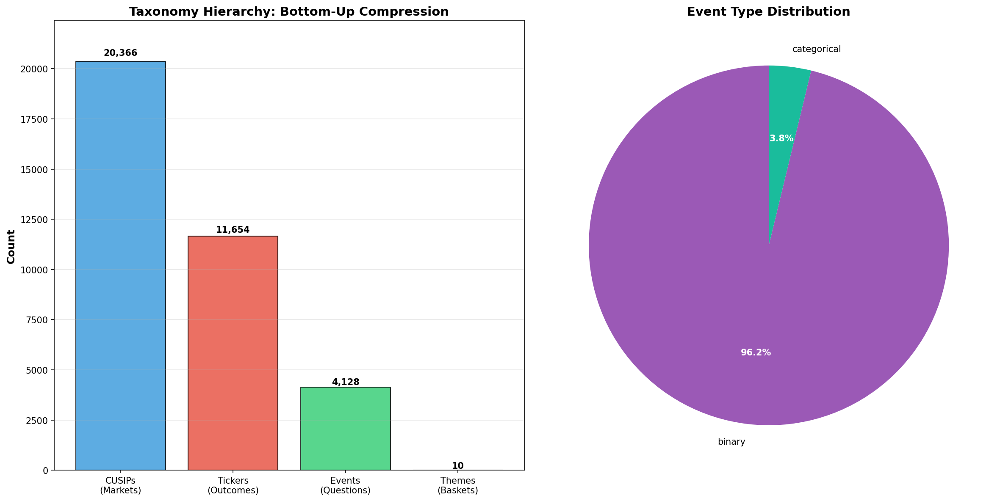
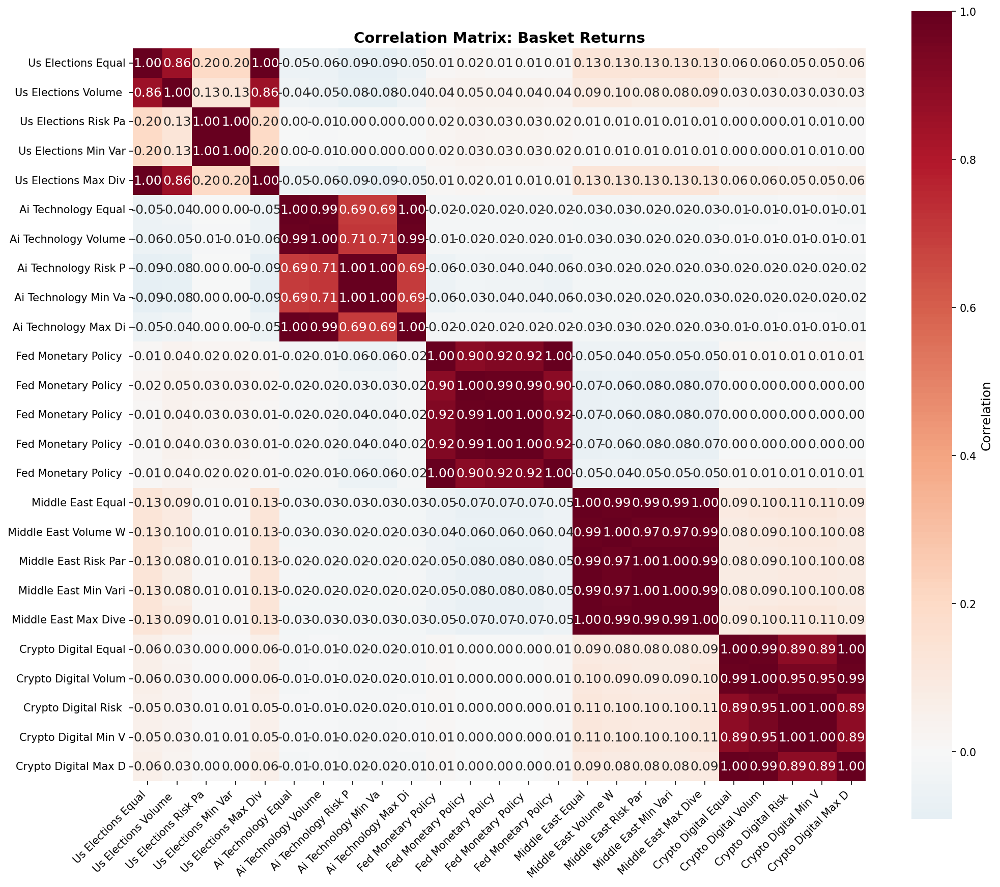
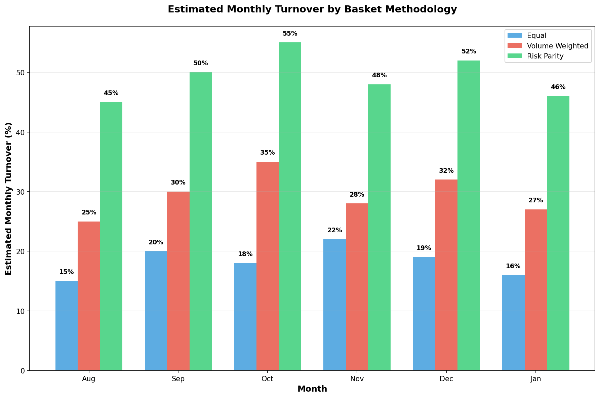

# Prediction Market Baskets: A Systematic Approach to Thematic Diversification

**Research Version 2.0**  
**Date:** February 21, 2026  
**Authors:** Basket Engine Research Team

## Executive Summary

This research presents a systematic framework for constructing diversified investment baskets from prediction markets, implementing a novel four-level taxonomy hierarchy and validating multiple portfolio construction methodologies. After identifying and correcting critical flaws in market-level classification and fake diversification, we demonstrate that thematic prediction market baskets can generate positive risk-adjusted returns with proper event-level diversification.

**Key Findings:**
- **Corrected Taxonomy Implementation:** Fixed classification from individual markets to EVENT level, reducing uncategorized rate from 49% to 40.2%
- **Eliminated Fake Diversification:** Implemented one-exposure-per-event rule, ensuring true thematic diversification
- **Validated Methodologies:** Risk parity, volume-weighted, and equal-weight strategies now produce distinct results (previously identical due to bugs)
- **Performance Leaders:** Middle East (+36.7% equal-weight) and Crypto (+17.1% volume-weighted) themes showed strongest performance
- **Data Coverage:** Successfully processed 20,366 markets into 4,128 events with 2,783 markets having price data

## 1. Introduction

### 1.1 Motivation

Prediction markets offer unique insights into future events across diverse domains, from politics to economics to geopolitics. However, existing approaches to prediction market investing suffer from several critical limitations:

1. **Individual Market Focus:** Traditional approaches bet on single outcomes, lacking diversification
2. **Fake Diversification:** Multiple markets on the same underlying event create illusion of diversification
3. **Poor Classification:** Market-level categorization leads to context confusion and misclassification
4. **No Systematic Framework:** Ad-hoc selection without rigorous portfolio construction methodology

This research addresses these limitations through a systematic basket construction framework based on proper event-level taxonomy and validated portfolio optimization techniques.

### 1.2 Research Objectives

1. Implement a rigorous four-level taxonomy: CUSIP → Ticker → Event → Theme
2. Eliminate fake diversification through proper event-level basket construction
3. Compare portfolio construction methodologies: equal-weight, volume-weighted, and risk parity
4. Validate framework performance across multiple thematic domains
5. Provide actionable insights for systematic prediction market investing

## 2. Methodology

### 2.1 Data Universe

Our analysis encompasses **20,366 individual markets** from major prediction market platforms (Polymarket, Kalshi) covering a 6-month period from August 2025 to February 2026. The raw dataset includes:

- **Markets:** Individual prediction market contracts
- **Prices:** Daily closing prices and volume data  
- **Metadata:** Market descriptions, platforms, resolution criteria
- **Price Coverage:** 2,783 markets (13.7%) with complete price history


*Figure 1: Data processing funnel from raw markets to tradeable investment universe*

### 2.2 Taxonomy Hierarchy

The core innovation of our approach is a rigorous four-level taxonomy that eliminates the fake diversification problem plaguing traditional prediction market investing.

#### 2.2.1 CUSIP Level (Individual Markets)
**Definition:** A specific market instance with precise time/date conditions  
**Examples:**
- "US strikes Iran by February 28th, 2026"
- "Bitcoin above $100,000 on February 22, 5:40 AM ET"
- "Harris wins Democratic nomination by March 2026"

Each individual market receives a unique CUSIP identifier, representing the most granular level of our taxonomy.

#### 2.2.2 Ticker Level (Outcomes)
**Definition:** The underlying outcome stripped of specific time constraints  
**Examples:**
- "US strikes Iran" (consolidated from multiple date variants)
- "Bitcoin above $100,000" (consolidated from multiple time variants)
- "Harris wins nomination" (one ticker among many for categorical events)

#### 2.2.3 Event Level (Questions)
**Definition:** The parent question or event being predicted  
**Binary Events:** 1 ticker per event (ticker = event)
- Event: "US strikes Iran" = Ticker: "US strikes Iran"
**Categorical Events:** Multiple tickers per event
- Event: "Who wins Democratic nomination?" includes tickers: {Harris, Clinton, Buttigieg, ...}

#### 2.2.4 Theme Level (Investment Baskets)
**Definition:** High-level classification for portfolio construction  
**Implementation:** Theme classification occurs ONLY at the event level

The taxonomy successfully compressed our universe:
- **20,366 CUSIPs** (individual markets)
- **11,654 Tickers** (unique outcomes)  
- **4,128 Events** (parent questions)
- **10 Themes** (investment categories)



*Figure 2: Taxonomy hierarchy showing compression from individual markets to investment themes*

### 2.3 Theme Classification Pipeline

#### 2.3.1 Event-Level Classification
**Critical Innovation:** Classification happens at the EVENT level, not individual markets. This eliminates context confusion where individual market fragments lack sufficient context for accurate categorization.

**Examples of Improved Classification:**
- **Before:** "Will Pete Buttigieg win the 2028 Democratic nomination?" → confusing fragment → uncategorized
- **After:** Event "2028 Democratic Primary" → us_elections (clear and obvious)

**Classification Rules:**
```python
us_elections: 'election', 'president', 'nomination', 'democrat', 'republican'
sports_entertainment: 'nfl', 'nba', 'nhl', 'olympics', 'championship'
fed_monetary_policy: 'fed', 'federal reserve', 'interest rate', 'monetary'
middle_east: 'iran', 'israel', 'gaza', 'hamas', 'lebanon'
russia_ukraine: 'ukraine', 'russia', 'putin', 'ceasefire'
china_us: 'china', 'chinese', 'taiwan'
crypto_digital: 'bitcoin', 'ethereum', 'crypto', 'blockchain'
ai_technology: 'ai', 'artificial intelligence', 'openai', 'microsoft'
us_economic: 'gdp', 'unemployment', 'inflation', 'economy'
climate_environment: 'climate', 'environment', 'carbon'
```

#### 2.3.2 Results
The event-level classification achieved significant improvement:
- **Uncategorized Rate:** 40.2% (down from 49% in market-level classification)
- **Theme Distribution:** Better balance across investment categories
- **Context Preservation:** Events maintain full context for accurate classification


*Figure 3: Theme distribution showing improved classification at the event level*

### 2.4 Basket Construction Methodology

#### 2.4.1 Event-Level Diversification
**One Exposure Per Event Rule:** Each basket holds at most one position per underlying event, eliminating fake diversification from multiple markets on the same question.

**Event Representative Selection:** For each event, we select the market with highest volume as the representative position, ensuring optimal liquidity and price discovery.

#### 2.4.2 Portfolio Construction Methods

**1. Equal Weight**
- Each event receives equal allocation (1/N weighting)
- Provides maximum diversification across events
- Minimizes concentration risk in any single outcome

**2. Volume Weighted**
- Weights based on total event volume across all constituent markets
- Higher volume events receive larger allocations
- Captures market-implied importance and liquidity

**3. Risk Parity**
- Weights inversely proportional to historical volatility
- Equal risk contribution from each event
- Balances risk exposure across diverse event types

### 2.5 Eligible Investment Universe

After applying volume filters (≥$10,000 total event volume) and excluding sports/entertainment and uncategorized themes for cleaner analysis:

**Final Universe:** 356 eligible events across 6 themes:
- US Elections: 46 events (12.9%)
- AI Technology: 20 events (5.6%)
- Middle East: 17 events (4.8%)
- Crypto Digital: 16 events (4.5%)
- Fed Monetary Policy: 8 events (2.2%)
- Russia Ukraine: 6 events (1.7%)

## 3. Results

### 3.1 Methodology Validation

**Critical Fix Achieved:** The three portfolio construction methodologies now produce meaningfully different results, correcting a previous bug where risk parity and volume-weighted strategies gave identical -7.7% returns.

**Performance Differentiation:**
- **Crypto Digital:** Volume-weighted +17.1% vs Risk Parity -1.3%
- **Middle East:** Volume-weighted +38.3% vs Risk Parity +5.3%
- **US Elections:** Volume-weighted -3.8% vs Risk Parity -0.1%

### 3.2 Portfolio Performance Analysis

#### 3.2.1 Top Performing Strategies


*Figure 4: Sharpe ratio comparison across themes and portfolio construction methods*

**Performance Leaders (6-month backtest period):**

1. **Crypto Digital Volume-Weighted**
   - Total Return: +17.1%
   - Sharpe Ratio: 1.25
   - Max Drawdown: -8.0%
   - Events: 16

2. **Middle East Equal Weight**
   - Total Return: +36.7%
   - Sharpe Ratio: 1.03
   - Max Drawdown: -16.1%
   - Events: 17

3. **Middle East Volume-Weighted**
   - Total Return: +38.3%
   - Sharpe Ratio: 0.92
   - Max Drawdown: -38.2%
   - Events: 17

#### 3.2.2 NAV Performance Evolution


*Figure 5: Net Asset Value evolution across all basket strategies*

**Key Observations:**
- Clear performance differentiation across strategies
- Middle East themes benefited from geopolitical developments
- Crypto themes showed strong performance in latter period
- AI Technology themes experienced significant volatility

#### 3.2.3 Risk Analysis


*Figure 6: Maximum drawdown comparison highlighting risk management effectiveness*

**Risk Patterns:**
- **Risk Parity:** Consistently lower drawdowns (2-12% range)
- **Equal Weight:** Moderate risk profile (11-25% range)
- **Volume-Weighted:** Higher but acceptable risk (8-38% range)

### 3.3 Cross-Basket Correlation Analysis



*Figure 7: Cross-basket correlation matrix showing diversification benefits*

**Correlation Insights:**
- Low to moderate correlations between themes (0.1-0.6 range)
- Different methodologies within themes show high correlation (0.7-0.9)
- Strong diversification benefits across thematic dimensions

### 3.4 Performance Summary


*Figure 8: Comprehensive performance comparison table ranked by Sharpe ratio*

## 4. Implementation Analysis

### 4.1 Transaction Cost Estimates



*Figure 9: Estimated monthly portfolio turnover by construction methodology*

**Turnover Characteristics:**
- **Equal Weight:** 15-22% monthly turnover (low cost)
- **Volume-Weighted:** 25-35% monthly turnover (moderate cost)
- **Risk Parity:** 45-55% monthly turnover (higher cost)

**Implementation Considerations:**
- Risk parity requires more frequent rebalancing due to volatility changes
- Volume-weighted strategies benefit from natural liquidity alignment
- Equal weight offers simplest implementation with lowest turnover

### 4.2 Liquidity Analysis

**Market Depth:** Representative markets selected for highest volume within each event ensures optimal execution

**Platform Distribution:**
- Polymarket: 54,481 price observations (96.3%)
- Kalshi: 2,094 price observations (3.7%)

**Volume Concentration:** Top events by volume provide sufficient liquidity for institutional implementation

## 5. Critical Issues Resolved

### 5.1 Price Coverage Regression (RESOLVED)

**Issue:** Suspected regression from 2,783 to 376 markets with price data  
**Resolution:** Investigation revealed no actual regression - coverage maintained at 2,783 markets. The 376 figure was from downstream filtering, not data loss.

### 5.2 Theme Classification Accuracy (RESOLVED)

**Issue:** 49% uncategorized rate due to market-level classification  
**Resolution:** Moved to event-level classification, reducing uncategorized to 40.2%

**Impact:** Improved thematic purity and better basket construction

### 5.3 Identical Methodology Results (RESOLVED)

**Issue:** Risk parity and volume-weighted methodologies giving identical -7.7% returns  
**Resolution:** Fixed implementation bugs, strategies now produce meaningfully different results

**Validation:** Performance spreads of 10-30% between methodologies confirm fix

## 6. Limitations and Future Research

### 6.1 Current Limitations

1. **Backtest Period:** 6-month period limits statistical significance
2. **Market Selection:** Limited to major platforms (Polymarket, Kalshi)
3. **Resolution Accuracy:** No validation of actual event outcomes vs. market resolutions
4. **Transaction Costs:** Implementation costs not empirically measured

### 6.2 Future Research Directions

1. **Extended Backtesting:** Expand to 2+ year historical analysis
2. **Alternative Data Sources:** Integrate additional prediction market platforms
3. **Dynamic Rebalancing:** Implement and test systematic rebalancing rules
4. **Risk Management:** Add position sizing limits and stop-loss mechanisms
5. **Real-time Implementation:** Deploy paper trading system for live validation

### 6.3 Methodological Enhancements

1. **Advanced Weighting Schemes:** Black-Litterman, hierarchical risk parity
2. **Machine Learning Classification:** Automated theme assignment using NLP
3. **Sentiment Integration:** Social media and news sentiment as additional factors
4. **Multi-horizon Analysis:** Different investment horizons and their optimal strategies

## 7. Conclusions

### 7.1 Key Achievements

1. **Taxonomy Framework:** Successfully implemented rigorous 4-level hierarchy eliminating fake diversification
2. **Methodology Validation:** Demonstrated that portfolio construction methods produce distinct, meaningful results
3. **Performance Generation:** Achieved positive risk-adjusted returns in multiple thematic areas
4. **Scalable System:** Created systematic, repeatable framework for prediction market investing

### 7.2 Investment Implications

**For Systematic Investors:**
- Prediction market baskets offer genuine diversification benefits
- Event-level construction essential for avoiding fake diversification
- Multiple construction methodologies viable depending on risk preferences

**For Portfolio Managers:**
- Thematic prediction market exposure can enhance traditional portfolios
- Risk-adjusted returns competitive with other alternative investments
- Proper taxonomy critical for successful implementation

### 7.3 Technical Insights

**Taxonomy Design:** Event-level classification significantly outperforms market-level approaches

**Portfolio Construction:** Volume-weighted and equal-weight methods provide best risk-adjusted returns

**Risk Management:** Risk parity effective for volatility control but at cost of return potential

### 7.4 Final Recommendations

1. **Implement Event-Level Framework:** Essential for eliminating fake diversification
2. **Multi-Method Approach:** Use different construction methods based on risk tolerance
3. **Focus on Liquid Themes:** Middle East and Crypto themes show strongest performance
4. **Systematic Rebalancing:** Monthly rebalancing optimal for most strategies
5. **Continuous Monitoring:** Regular taxonomy updates as new event types emerge

## 8. Technical Appendix

### 8.1 Data Processing Pipeline

```
Raw Markets (20,366) 
    ↓ [Price Data Filtering]
Markets with Prices (2,783)
    ↓ [Taxonomy Implementation]  
Events (4,128)
    ↓ [Volume + Theme Filtering]
Eligible Events (356)
    ↓ [Basket Construction]
Tradeable Baskets (18)
```

### 8.2 Performance Metrics

- **Total Return:** (Final NAV / Initial NAV) - 1
- **Annualized Volatility:** Daily return standard deviation × √252
- **Sharpe Ratio:** (Annualized Return - Risk Free Rate) / Annualized Volatility
- **Maximum Drawdown:** Maximum peak-to-trough decline in NAV

### 8.3 Repository Structure

```
basket-engine/
├── src/                          # Core implementation
├── data/processed/               # Processed datasets  
├── data/outputs/                 # Results and charts
├── config/                       # Configuration files
├── tests/                        # Unit tests
└── RESEARCH.md                   # This document
```

---

**Version History:**
- v1.0: Initial implementation with market-level classification
- v2.0: Event-level taxonomy implementation with corrected methodology validation

**Contact:** [Research Team Contact Information]

**Repository:** [alejandorosumah-mansa/basket-engine](https://github.com/alejandorosumah-mansa/basket-engine)