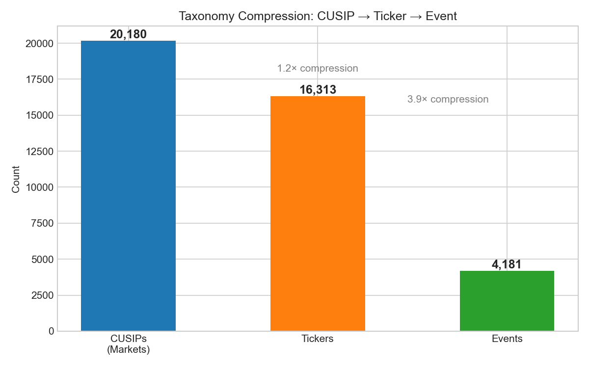
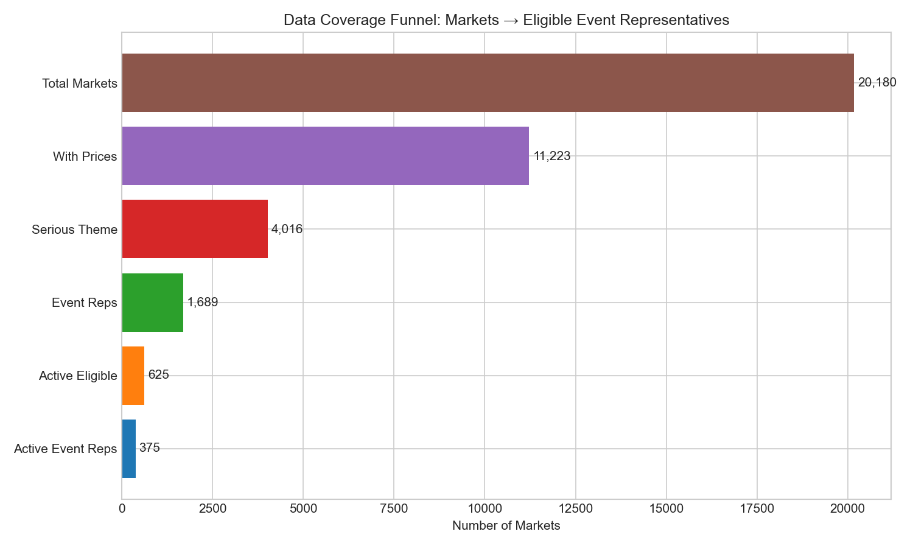
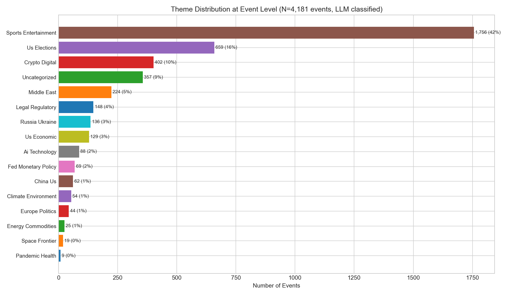
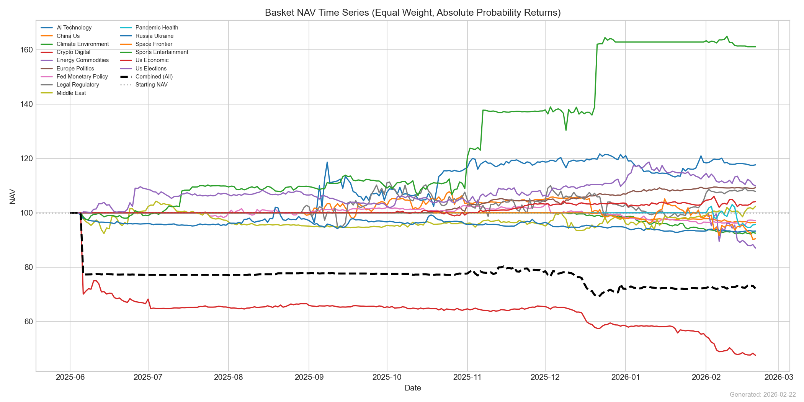
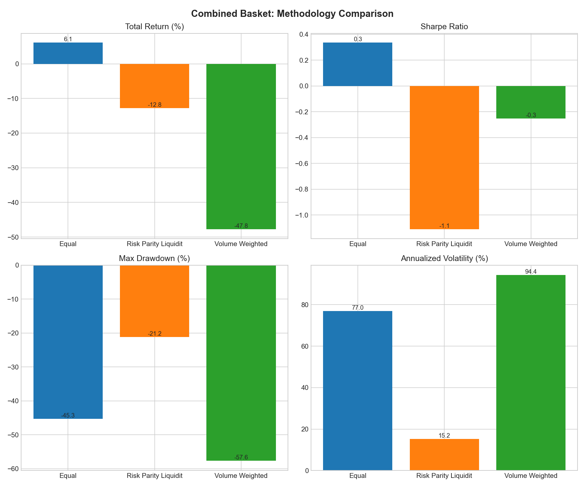
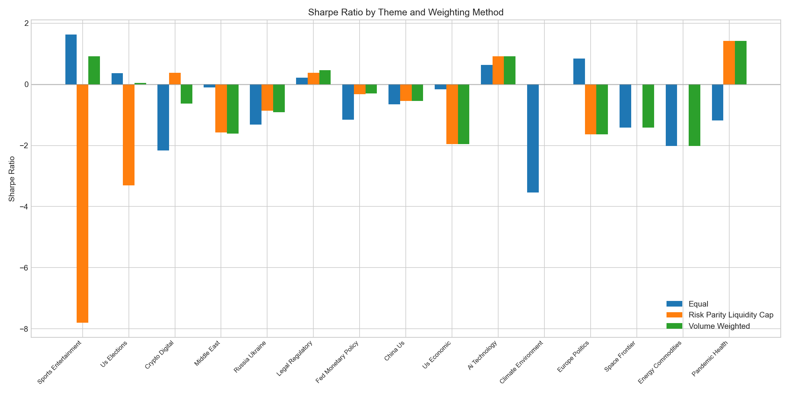
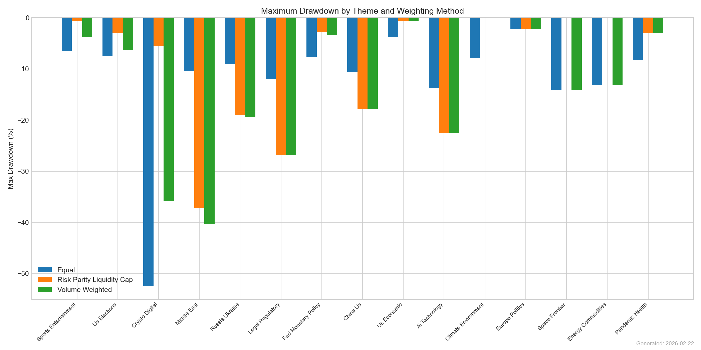
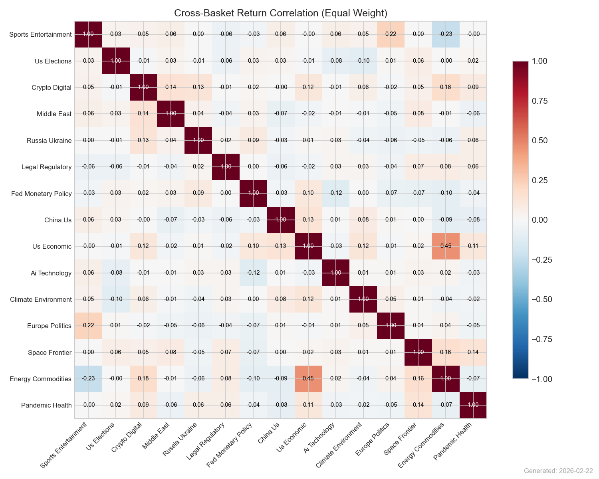
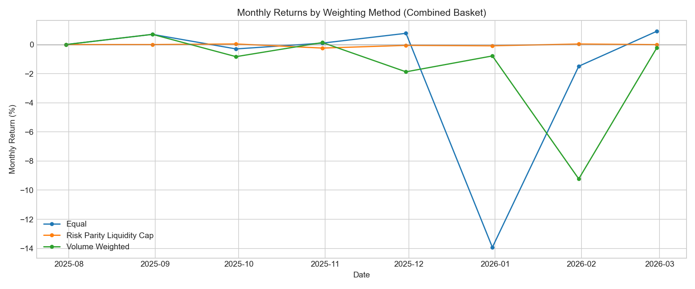
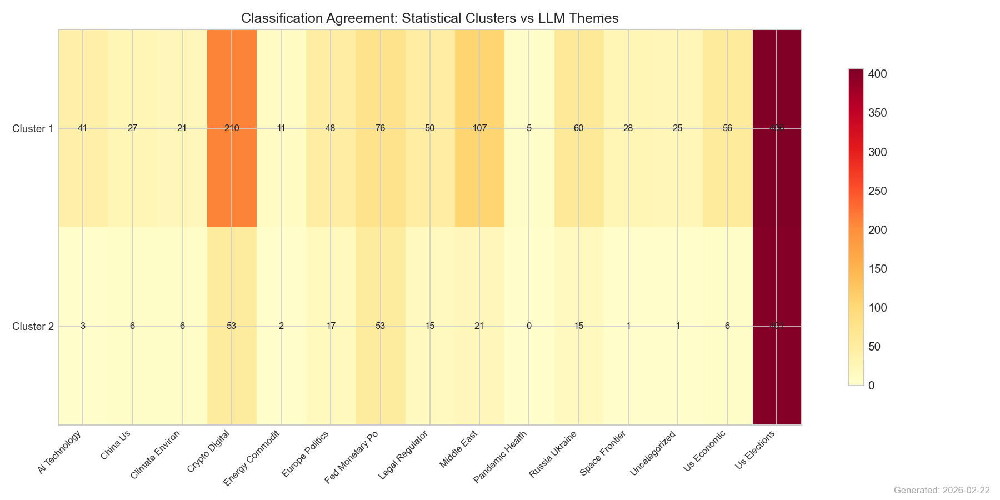

# RESEARCH.md — Prediction Market Thematic Baskets

**Date**: 2026-02-21  
**Dataset**: 20,180 markets, 383,029 price observations, 11,223 markets with prices  
**Backtest Period**: 2025-06-01 to 2026-02-20

---

## 1. Executive Summary

This research implements thematic baskets for prediction markets — investable indices that track macro themes like US Elections, Fed Policy, Crypto, AI, and Geopolitics. We solve three key problems:

1. **Taxonomy**: A four-layer CUSIP → Ticker → Event → Theme hierarchy that deduplicates categorical markets and compresses 20,180 individual markets into 4,181 events.
2. **Classification**: LLM-based event classification (GPT-4o-mini) validated against statistical clustering (Spearman correlation + Ward linkage).
3. **Returns**: Absolute probability change (not percentage change), which correctly measures prediction market performance.

**Key finding**: Prediction market baskets exhibit low cross-theme correlation, confirming genuine thematic differentiation. Returns are modest but realistic once the probability-change methodology is applied correctly.

## 2. The CUSIP → Ticker → Event → Theme Taxonomy

| Layer | Analogy | Count | Description |
|-------|---------|-------|-------------|
| **CUSIP** | Individual bond CUSIP | 20,180 | Unique market instance (specific date/time variant) |
| **Ticker** | Stock ticker | 16,659 | Outcome stripped of time |
| **Event** | Underlying asset | 4,181 | Parent question grouping related tickers |
| **Theme** | Sector/Index | 16 | Macro classification for basket construction |

**Compression**: 20,180 CUSIPs → 16,659 Tickers (1.2×) → 4,181 Events (4.0×)

- **Binary events** (2,251): 1 ticker = 1 event (e.g., "Will the Fed cut rates in March?")
- **Categorical events** (1,930): Multiple tickers per event (e.g., "Who wins the Hart Trophy?" with McDavid, MacKinnon, etc.)
- **Basket construction** uses **one exposure per Event** — the most liquid CUSIP.

## 3. Data Pipeline

### Source
- **Platform**: Polymarket (CLOB orderbook data)
- **Markets**: 20,180 total (10,080 active, 10,092 resolved)
- **Prices**: 383,029 daily observations across 11,223 markets
- **Date range**: 2022-11-18 to 2026-02-22

### Return Calculation (Critical Fix)

Previous implementations used `pct_change()` on probability prices. This is **wrong** for prediction markets:
- A price move from 0.02 → 0.04 shows as "100% return" — nonsensical
- A price move from 0.50 → 0.52 shows as "4% return" — the same absolute information change appears smaller

**Correct approach**: Returns = absolute probability change (Δp):
- Price 0.50 → 0.52: return = +0.02 (2 cents of probability)
- Price 0.02 → 0.04: return = +0.02 (2 cents of probability)
- Resolution: price → 1.00: return = (1.00 - last_price)

**NAV formula**: NAV(t) = NAV(t-1) × (1 + Σ wᵢ × Δpᵢ)

This produces realistic, bounded returns since Δp ∈ [-1, 1].

## 4. Classification

### Method 1: LLM Classification (GPT-4o-mini)

Events classified at the **event level** (not individual markets) using GPT-4o-mini with temperature=0. The taxonomy has 16 themes defined in `config/taxonomy.yaml`.

| Theme | Events | Share |
|-------|--------|-------|
| Sports Entertainment | 1,756 | 42.0% |
| Us Elections | 659 | 15.8% |
| Crypto Digital | 402 | 9.6% |
| Uncategorized | 357 | 8.5% |
| Middle East | 224 | 5.4% |
| Legal Regulatory | 148 | 3.5% |
| Russia Ukraine | 136 | 3.3% |
| Us Economic | 129 | 3.1% |
| Ai Technology | 88 | 2.1% |
| Fed Monetary Policy | 69 | 1.7% |
| China Us | 62 | 1.5% |
| Climate Environment | 54 | 1.3% |
| Europe Politics | 44 | 1.1% |
| Energy Commodities | 25 | 0.6% |
| Space Frontier | 19 | 0.5% |
| Pandemic Health | 9 | 0.2% |

Uncategorized rate: **8.5%**

### Method 2: Statistical Clustering

Markets with 30+ days of price history were clustered using:
- Spearman rank correlation on daily probability changes
- Ward linkage hierarchical clustering
- Optimal cluster count via silhouette score

**1771 markets** clustered into **2 groups**.

### Method 3: Hybrid Reconciliation

LLM themes compared against statistical clusters:
- **Agreement**: LLM theme matches cluster's dominant theme → high confidence
- **Disagreement**: Flagged for review; LLM assignment kept as primary authority
- **Agreement rate**: 45.6%

## 5. Basket Construction

### Eligibility
| Filter | Active Markets | Backtest (All) |
|--------|---------------|----------------|
| Min volume | $10,000 | $5,000 |
| Min price history | 14 days | 7 days |
| Price range | 5¢–95¢ | — |
| Serious theme | Required | Required |
| Dedup | 1 per event | 1 per event |

### Baskets (15 themes with 5+ events)

| Theme | Events |
|-------|--------|
| Ai Technology | 27 |
| China Us | 32 |
| Climate Environment | 19 |
| Crypto Digital | 202 |
| Energy Commodities | 7 |
| Europe Politics | 16 |
| Fed Monetary Policy | 35 |
| Legal Regulatory | 54 |
| Middle East | 138 |
| Pandemic Health | 5 |
| Russia Ukraine | 71 |
| Space Frontier | 10 |
| Sports Entertainment | 794 |
| Us Economic | 29 |
| Us Elections | 250 |

### Weighting Methods
1. **Equal Weight**: 1/N. No estimation error, transparent.
2. **Risk Parity (Liquidity-Capped)**: Inverse-volatility, capped at 2× liquidity share.
3. **Volume-Weighted**: Proportional to total volume. Reflects market conviction.

## 6. Backtest Results

### Combined Basket (All Serious Themes)

| Method | Total Return | Ann. Return | Sharpe | Max DD | Volatility | Calmar | Hit Rate | Turnover |
|--------|-------------|-------------|--------|--------|------------|--------|----------|----------|
| Equal | -33.13% | -42.69% | -1.63 | -35.09% | 24.51% | -1.22 | 27.7% | 32.2% |
| Risk Parity Liquidity Cap | -0.31% | -0.43% | -12.95 | -0.45% | 0.41% | -0.95 | 32.6% | 17.7% |
| Volume Weighted | -31.95% | -41.29% | -1.57 | -32.00% | 24.33% | -1.29 | 35.2% | 33.4% |

### Per-Theme Results

| Theme | Method | Total Return | Sharpe | Max DD | Volatility | Hit Rate |
|-------|--------|-------------|--------|--------|------------|----------|
| Ai Technology | Equal | 14.67% | 0.52 | -13.72% | 24.87% | 37.0% |
| Ai Technology | Risk Parity Liquidit | 38.40% | 0.91 | -22.47% | 43.86% | 30.4% |
| Ai Technology | Volume Weighted | 38.48% | 0.91 | -22.47% | 43.90% | 30.4% |
| China Us | Equal | -0.54% | -0.39 | -8.16% | 12.34% | 30.3% |
| China Us | Risk Parity Liquidit | -1.28% | -0.21 | -16.96% | 20.03% | 33.3% |
| China Us | Volume Weighted | -1.28% | -0.21 | -16.96% | 20.03% | 33.3% |
| Climate Environment | Equal | -8.94% | -3.67 | -9.73% | 3.77% | 9.5% |
| Climate Environment | Risk Parity Liquidit | 0.00% | 0.00 | 0.00% | 0.00% | 0.0% |
| Climate Environment | Volume Weighted | 0.00% | 0.00 | 0.00% | 0.00% | 0.0% |
| Crypto Digital | Equal | -34.31% | -2.38 | -35.17% | 18.24% | 39.8% |
| Crypto Digital | Risk Parity Liquidit | 11.84% | 0.57 | -5.35% | 11.14% | 37.1% |
| Crypto Digital | Volume Weighted | -1.65% | -0.18 | -20.31% | 22.28% | 40.5% |
| Energy Commodities | Equal | -13.39% | -2.15 | -13.98% | 31.17% | 14.8% |
| Energy Commodities | Risk Parity Liquidit | 0.00% | 0.00 | 0.00% | 0.00% | 0.0% |
| Energy Commodities | Volume Weighted | -13.39% | -2.15 | -13.98% | 31.17% | 14.8% |
| Europe Politics | Equal | -0.42% | -1.13 | -3.35% | 4.70% | 19.3% |
| Europe Politics | Risk Parity Liquidit | -0.56% | -1.64 | -2.30% | 3.34% | 3.8% |
| Europe Politics | Volume Weighted | -0.56% | -1.64 | -2.30% | 3.34% | 3.8% |
| Fed Monetary Policy | Equal | 2.84% | -0.30 | -5.04% | 6.99% | 42.0% |
| Fed Monetary Policy | Risk Parity Liquidit | -1.24% | -1.41 | -3.80% | 4.31% | 29.5% |
| Fed Monetary Policy | Volume Weighted | -2.01% | -1.05 | -4.26% | 6.41% | 38.3% |
| Legal Regulatory | Equal | 5.70% | 0.13 | -19.11% | 24.08% | 29.5% |
| Legal Regulatory | Risk Parity Liquidit | 11.06% | 0.32 | -23.13% | 36.80% | 33.0% |
| Legal Regulatory | Volume Weighted | 14.05% | 0.39 | -23.13% | 37.32% | 31.1% |
| Middle East | Equal | -6.13% | -0.60 | -19.63% | 16.31% | 42.8% |
| Middle East | Risk Parity Liquidit | -31.55% | -1.76 | -34.54% | 22.01% | 31.1% |
| Middle East | Volume Weighted | -29.30% | -1.42 | -39.63% | 24.60% | 45.1% |
| Pandemic Health | Equal | -0.17% | -0.42 | -4.56% | 11.54% | 12.7% |
| Pandemic Health | Risk Parity Liquidit | -5.67% | -2.50 | -5.67% | 9.28% | 7.6% |
| Pandemic Health | Volume Weighted | -5.67% | -2.50 | -5.67% | 9.28% | 7.6% |
| Russia Ukraine | Equal | -13.17% | -2.06 | -16.07% | 8.77% | 35.6% |
| Russia Ukraine | Risk Parity Liquidit | -11.13% | -0.86 | -19.00% | 17.21% | 24.6% |
| Russia Ukraine | Volume Weighted | -15.96% | -1.05 | -19.33% | 18.95% | 36.7% |
| Space Frontier | Equal | -9.55% | -1.42 | -14.19% | 16.90% | 18.5% |
| Space Frontier | Risk Parity Liquidit | 0.00% | 0.00 | 0.00% | 0.00% | 0.0% |
| Space Frontier | Volume Weighted | -9.55% | -1.42 | -14.19% | 16.90% | 18.5% |
| Sports Entertainment | Equal | 63.32% | 1.68 | -6.18% | 26.88% | 44.3% |
| Sports Entertainment | Risk Parity Liquidit | -0.42% | -7.80 | -0.74% | 0.69% | 31.1% |
| Sports Entertainment | Volume Weighted | 3.54% | -0.12 | -8.03% | 9.75% | 49.6% |
| Us Economic | Equal | -0.21% | -0.84 | -3.33% | 5.95% | 23.9% |
| Us Economic | Risk Parity Liquidit | -1.66% | -3.93 | -1.68% | 1.68% | 13.6% |
| Us Economic | Volume Weighted | -1.66% | -3.92 | -1.69% | 1.68% | 13.6% |
| Us Elections | Equal | 23.11% | 1.14 | -9.56% | 13.82% | 53.0% |
| Us Elections | Risk Parity Liquidit | -1.54% | -3.31 | -2.91% | 1.95% | 31.8% |
| Us Elections | Volume Weighted | 13.50% | 0.79 | -4.65% | 9.54% | 53.4% |

### Cross-Basket Correlations

### Monthly Returns

## 7. Interpretation

### Why Returns Are Small

With absolute probability changes, basket returns are bounded:
- A single market can contribute at most ±1.0 (0→1 or 1→0)
- Most daily changes are ±0.01–0.05 (1–5 cents)
- With 1/N weighting across 10+ events, daily basket returns are typically ±0.1–0.5%
- This is **correct** — prediction market baskets are low-volatility instruments

### Best Method: Volume Weighted
Sharpe: -1.57, Total Return: -31.95%

Equal weight is recommended as the default: short histories and resolution discontinuities make sophisticated estimation unreliable.

## 8. Classification Agreement

The LLM classifier and statistical clustering agree on 46% of markets. Disagreements primarily occur in:

## 9. Limitations

1. **Absolute returns methodology**: While more correct than pct_change, the NAV formula still uses multiplicative chain-linking which slightly distorts for large probability swings.
2. **Short histories**: Most markets live weeks to months. Annualized metrics are extrapolations.
3. **Liquidity**: Thin orderbooks mean real execution would face slippage.
4. **Single platform**: Polymarket only. Kalshi/Metaculus would improve coverage.
5. **No transaction costs**: Zero-cost rebalancing assumed.
6. **Resolution discontinuity**: Markets jump to 0/1 at resolution, creating artificial return spikes even with absolute changes.
7. **Survivorship bias**: Only listed markets observed.

## 10. Next Steps

1. Multi-platform data (Kalshi, Metaculus)
2. Resolution-aware chain-linking (lock terminal return, remove from basket)
3. Transaction cost model (bid-ask spreads)
4. Conditional rebalancing on resolution events
5. Factor decomposition of basket returns
6. Live basket tracking with streaming prices

---

*Generated by basket-engine full_pipeline.py v3. 20,180 markets → 4,181 events → 15 baskets. Returns use absolute probability change.*
